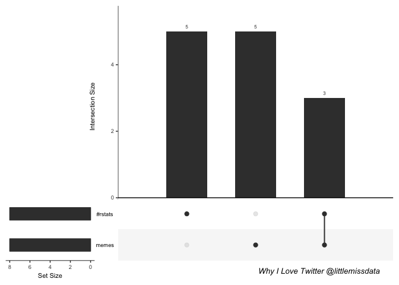

Install and Load Packages
-------------------------

Round 1: Simple and Fun Set Intersection
----------------------------------------

``` r
#Data
expressionInput <- c(`#rstats` = 5, memes = 5, `#rstats&memes`=3)

#Venn
#note on set up for java v11 jdk (v12 does not work with this)
myExpVenn <- venneuler(expressionInput)
plot(myExpVenn, main = "Why I Love Twitter", sub = "@littlemissdata")

#UpsetR
upset(fromExpression(expressionInput), order.by = "freq")
```


``` r
grid.text(
  "Why I Love Twitter @littlemissdata",
  x = 0.80,
  y = 0.05,
  gp = gpar(
    fontsize = 10,
    fontface = 3
  )
) #grid hack from https://github.com/hms-dbmi/UpSetR/issues/76
```



Bring in Data
-------------

You can also embed plots, for example:

    ##   X1..In.the.past.3.months..how.often.did.you.participate.in.physical.activities.like.walking.
    ## 1                                                                          At least once a day
    ## 2                                                                         At least once a week
    ## 3                                                                          At least once a day
    ## 4                                                                          At least once a day
    ## 5                                                                          At least once a day
    ## 6                                                                          At least once a day
    ##   X2..Are.you.aware.that.Toronto.Public.Health.and.your.Local.Health.Integration.Network.offer.free.exercise.and.falls.prevention.programs.
    ## 1                                                                                                                                        No
    ## 2                                                                                                                                       Yes
    ## 3                                                                                                                                        No
    ## 4                                                                                                                                        No
    ## 5                                                                                                                                        No
    ## 6                                                                                                                                       Yes
    ##   X3..In.the.past.year.have.you.visited.a.library.branch..accessed.the.library.online.or.contacted.the.library.by.telephone.
    ## 1                                                                                                                         No
    ## 2                                                                                                                        Yes
    ## 3                                                                                                                        Yes
    ## 4                                                                                                                         No
    ## 5                                                                                                                        Yes
    ## 6                                                                                                                        Yes
    ##   X4..How.often.do.you.use.the.internet.
    ## 1                    At least once a day
    ## 2            At least a few times a week
    ## 3                    At least once a day
    ## 4                    At least once a day
    ## 5                    At least once a day
    ## 6                    At least once a day
    ##   X5..During.the.past.3.months..how.often.did.you.participate.in.volunteer.or.charity.work.
    ## 1                                                                                     Never
    ## 2                                                                                          
    ## 3                                                                     At least once a month
    ## 4                                                                     At least once a month
    ## 5                                                                     At least once a month
    ## 6                                                                                     Never
    ##   X6..To.get.around.Toronto..what.modes.of.transportation.do.you.use.frequently....TTC..bus..subway..or.streetcar..
    ## 1                                                                                                                 1
    ## 2                                                                                                                 1
    ## 3                                                                                                                 1
    ## 4                                                                                                                 1
    ## 5                                                                                                                NA
    ## 6                                                                                                                NA
    ##   X6..To.get.around.Toronto..what.modes.of.transportation.do.you.use.frequently....Walk.
    ## 1                                                                                      1
    ## 2                                                                                     NA
    ## 3                                                                                     NA
    ## 4                                                                                      1
    ## 5                                                                                      1
    ## 6                                                                                     NA
    ##   X6..To.get.around.Toronto..what.modes.of.transportation.do.you.use.frequently....Drive.
    ## 1                                                                                      NA
    ## 2                                                                                      NA
    ## 3                                                                                       1
    ## 4                                                                                       1
    ## 5                                                                                       1
    ## 6                                                                                       1
    ##   X6..To.get.around.Toronto..what.modes.of.transportation.do.you.use.frequently....Cycle.
    ## 1                                                                                      NA
    ## 2                                                                                      NA
    ## 3                                                                                      NA
    ## 4                                                                                      NA
    ## 5                                                                                      NA
    ## 6                                                                                      NA
    ##   X6..To.get.around.Toronto..what.modes.of.transportation.do.you.use.frequently....Taxi.or.Uber.
    ## 1                                                                                             NA
    ## 2                                                                                             NA
    ## 3                                                                                             NA
    ## 4                                                                                             NA
    ## 5                                                                                             NA
    ## 6                                                                                             NA
    ##   X6..To.get.around.Toronto..what.modes.of.transportation.do.you.use.frequently....Community.Transportation.Program..for.example.Toronto.Ride.or.iRIDE.
    ## 1                                                                                                                                                    NA
    ## 2                                                                                                                                                    NA
    ## 3                                                                                                                                                    NA
    ## 4                                                                                                                                                    NA
    ## 5                                                                                                                                                    NA
    ## 6                                                                                                                                                    NA
    ##   X6..To.get.around.Toronto..what.modes.of.transportation.do.you.use.frequently....Wheel.Trans.
    ## 1                                                                                            NA
    ## 2                                                                                             1
    ## 3                                                                                            NA
    ## 4                                                                                            NA
    ## 5                                                                                            NA
    ## 6                                                                                            NA
    ##   X6..To.get.around.Toronto..what.modes.of.transportation.do.you.use.frequently....Rides.from.family..friends.or.neighbours.
    ## 1                                                                                                                         NA
    ## 2                                                                                                                         NA
    ## 3                                                                                                                         NA
    ## 4                                                                                                                         NA
    ## 5                                                                                                                          1
    ## 6                                                                                                                         NA
    ##   X7..Do.you.frequently.use.the.TTC.
    ## 1                                Yes
    ## 2                                Yes
    ## 3                                Yes
    ## 4                                 No
    ## 5                                 No
    ## 6                                 No
    ##   If.you.answered.no.to.above.question..why.not....I.have.access.to.other.transportation.services.that.serve.me.well.
    ## 1                                                                                                                  NA
    ## 2                                                                                                                  NA
    ## 3                                                                                                                  NA
    ## 4                                                                                                                  NA
    ## 5                                                                                                                   1
    ## 6                                                                                                                   1
    ##   If.you.answered.no.to.above.question..why.not....It.is.quicker.to.drive..it.takes.less.time..
    ## 1                                                                                            NA
    ## 2                                                                                            NA
    ## 3                                                                                            NA
    ## 4                                                                                             1
    ## 5                                                                                             1
    ## 6                                                                                             1
    ##   If.you.answered.no.to.above.question..why.not....I.prefer.to.drive.
    ## 1                                                                  NA
    ## 2                                                                  NA
    ## 3                                                                  NA
    ## 4                                                                  NA
    ## 5                                                                   1
    ## 6                                                                   1
    ##   If.you.answered.no.to.above.question..why.not....TTC.is.not.affordable.for.me.
    ## 1                                                                             NA
    ## 2                                                                             NA
    ## 3                                                                             NA
    ## 4                                                                             NA
    ## 5                                                                             NA
    ## 6                                                                             NA
    ##   If.you.answered.no.to.above.question..why.not....The.nearest.TTC.stop.station.is.too.far.away.
    ## 1                                                                                             NA
    ## 2                                                                                             NA
    ## 3                                                                                             NA
    ## 4                                                                                             NA
    ## 5                                                                                             NA
    ## 6                                                                                              1
    ##   If.you.answered.no.to.above.question..why.not....The.nearest.TTC.stop.station.is.not.accessible.
    ## 1                                                                                               NA
    ## 2                                                                                               NA
    ## 3                                                                                               NA
    ## 4                                                                                               NA
    ## 5                                                                                               NA
    ## 6                                                                                               NA
    ##   If.you.answered.no.to.above.question..why.not....TTC.vehicles.are.not.accessible.for.me.
    ## 1                                                                                       NA
    ## 2                                                                                       NA
    ## 3                                                                                       NA
    ## 4                                                                                       NA
    ## 5                                                                                       NA
    ## 6                                                                                       NA
    ##   If.you.answered.no.to.above.question..why.not....The.TTC.is.too.crowded.
    ## 1                                                                       NA
    ## 2                                                                       NA
    ## 3                                                                       NA
    ## 4                                                                       NA
    ## 5                                                                       NA
    ## 6                                                                        1
    ##   If.you.answered.no.to.above.question..why.not....TTC.announcements.are.hard.to.hear.
    ## 1                                                                                   NA
    ## 2                                                                                   NA
    ## 3                                                                                   NA
    ## 4                                                                                   NA
    ## 5                                                                                   NA
    ## 6                                                                                   NA
    ##   If.you.answered.no.to.above.question..why.not....I.don.t.feel.safe.using.the.TTC.
    ## 1                                                                                NA
    ## 2                                                                                NA
    ## 3                                                                                NA
    ## 4                                                                                NA
    ## 5                                                                                NA
    ## 6                                                                                NA
    ##   X8..In.the.past.year..have.you.had.to.delay.home.repairs.or.modifications.because.they.were.unaffordable...A.major.home.repair.such.as.a.new.roof..furnace..or.plumbing.or.electrical.problems..
    ## 1                                                                                                                                                                                               NA
    ## 2                                                                                                                                                                                               NA
    ## 3                                                                                                                                                                                               NA
    ## 4                                                                                                                                                                                               NA
    ## 5                                                                                                                                                                                               NA
    ## 6                                                                                                                                                                                               NA
    ##   X8..In.the.past.year..have.you.had.to.delay.home.repairs.or.modifications.because.they.were.unaffordable...Modifications.to.make.your.home.more.accessible..for.example..converting.a.bathtub.to.a.shower..a.ramp..grab.bars.in.the.bathroom..or.better.li ...
    ## 1                                                                                                                                                                                                                                                             NA
    ## 2                                                                                                                                                                                                                                                             NA
    ## 3                                                                                                                                                                                                                                                             NA
    ## 4                                                                                                                                                                                                                                                             NA
    ## 5                                                                                                                                                                                                                                                             NA
    ## 6                                                                                                                                                                                                                                                             NA
    ##   X8..In.the.past.year..have.you.had.to.delay.home.repairs.or.modifications.because.they.were.unaffordable...No.or.not.applicable.
    ## 1                                                                                                                                1
    ## 2                                                                                                                               NA
    ## 3                                                                                                                                1
    ## 4                                                                                                                                1
    ## 5                                                                                                                                1
    ## 6                                                                                                                                1
    ##   X9..In.the.last.year..have.you.had.difficulty.paying.your.rent..mortgage..Hydro.bill..or.other.housing.costs..For.example..have.you.had.to.go.without.groceries.to.pay.for.rent.or.other.monthly.housing.expenses.
    ## 1                                                                                                                                                                                                                 No
    ## 2                                                                                                                                                                                                                 No
    ## 3                                                                                                                                                                                                                 No
    ## 4                                                                                                                                                                                                                 No
    ## 5                                                                                                                                                                                                                 No
    ## 6                                                                                                                                                                                                                 No
    ##   X10..Which.term.s..do.you.prefer.when.referring.to.people.aged.65.and.older...Elders.
    ## 1                                                                                    NA
    ## 2                                                                                    NA
    ## 3                                                                                    NA
    ## 4                                                                                    NA
    ## 5                                                                                    NA
    ## 6                                                                                    NA
    ##   X10..Which.term.s..do.you.prefer.when.referring.to.people.aged.65.and.older...Mature.Adults.
    ## 1                                                                                           NA
    ## 2                                                                                           NA
    ## 3                                                                                           NA
    ## 4                                                                                           NA
    ## 5                                                                                            1
    ## 6                                                                                           NA
    ##   X10..Which.term.s..do.you.prefer.when.referring.to.people.aged.65.and.older...Older.Adults.
    ## 1                                                                                          NA
    ## 2                                                                                           1
    ## 3                                                                                          NA
    ## 4                                                                                          NA
    ## 5                                                                                           1
    ## 6                                                                                          NA
    ##   X10..Which.term.s..do.you.prefer.when.referring.to.people.aged.65.and.older...Older.Persons.
    ## 1                                                                                           NA
    ## 2                                                                                            1
    ## 3                                                                                           NA
    ## 4                                                                                           NA
    ## 5                                                                                           NA
    ## 6                                                                                           NA
    ##   X10..Which.term.s..do.you.prefer.when.referring.to.people.aged.65.and.older...Older.Residents.
    ## 1                                                                                             NA
    ## 2                                                                                             NA
    ## 3                                                                                             NA
    ## 4                                                                                              1
    ## 5                                                                                             NA
    ## 6                                                                                             NA
    ##   X10..Which.term.s..do.you.prefer.when.referring.to.people.aged.65.and.older...Older.Torontonians.
    ## 1                                                                                                NA
    ## 2                                                                                                NA
    ## 3                                                                                                NA
    ## 4                                                                                                NA
    ## 5                                                                                                NA
    ## 6                                                                                                NA
    ##   X10..Which.term.s..do.you.prefer.when.referring.to.people.aged.65.and.older...Senior.Citizens.
    ## 1                                                                                             NA
    ## 2                                                                                             NA
    ## 3                                                                                             NA
    ## 4                                                                                              1
    ## 5                                                                                              1
    ## 6                                                                                             NA
    ##   X10..Which.term.s..do.you.prefer.when.referring.to.people.aged.65.and.older...Seniors.
    ## 1                                                                                      1
    ## 2                                                                                     NA
    ## 3                                                                                      1
    ## 4                                                                                     NA
    ## 5                                                                                      1
    ## 6                                                                                     NA
    ##   X11..What.are.your.top.three.concerns.related.to.older.persons.in.Toronto...Accessibility.
    ## 1                                                                                         NA
    ## 2                                                                                         NA
    ## 3                                                                                         NA
    ## 4                                                                                         NA
    ## 5                                                                                         NA
    ## 6                                                                                         NA
    ##   X11..What.are.your.top.three.concerns.related.to.older.persons.in.Toronto...Civic.Engagement.
    ## 1                                                                                            NA
    ## 2                                                                                            NA
    ## 3                                                                                            NA
    ## 4                                                                                            NA
    ## 5                                                                                            NA
    ## 6                                                                                            NA
    ##   X11..What.are.your.top.three.concerns.related.to.older.persons.in.Toronto...Communication.and.Information.
    ## 1                                                                                                         NA
    ## 2                                                                                                         NA
    ## 3                                                                                                          1
    ## 4                                                                                                          1
    ## 5                                                                                                          1
    ## 6                                                                                                         NA
    ##   X11..What.are.your.top.three.concerns.related.to.older.persons.in.Toronto...Food.Access.
    ## 1                                                                                       NA
    ## 2                                                                                       NA
    ## 3                                                                                       NA
    ## 4                                                                                       NA
    ## 5                                                                                       NA
    ## 6                                                                                       NA
    ##   X11..What.are.your.top.three.concerns.related.to.older.persons.in.Toronto...Health.Care.and.Home.Care.Services.
    ## 1                                                                                                               1
    ## 2                                                                                                              NA
    ## 3                                                                                                              NA
    ## 4                                                                                                               1
    ## 5                                                                                                               1
    ## 6                                                                                                              NA
    ##   X11..What.are.your.top.three.concerns.related.to.older.persons.in.Toronto...Housing.Affordability.and.Availability.
    ## 1                                                                                                                   1
    ## 2                                                                                                                  NA
    ## 3                                                                                                                   1
    ## 4                                                                                                                  NA
    ## 5                                                                                                                  NA
    ## 6                                                                                                                  NA
    ##   X11..What.are.your.top.three.concerns.related.to.older.persons.in.Toronto...Income.and.Employment.
    ## 1                                                                                                 NA
    ## 2                                                                                                 NA
    ## 3                                                                                                 NA
    ## 4                                                                                                 NA
    ## 5                                                                                                 NA
    ## 6                                                                                                 NA
    ##   X11..What.are.your.top.three.concerns.related.to.older.persons.in.Toronto...Recreation.and.Community.Services.Including.Libraries.
    ## 1                                                                                                                                 NA
    ## 2                                                                                                                                 NA
    ## 3                                                                                                                                 NA
    ## 4                                                                                                                                 NA
    ## 5                                                                                                                                  1
    ## 6                                                                                                                                 NA
    ##   X11..What.are.your.top.three.concerns.related.to.older.persons.in.Toronto...Respect.and.Social.Inclusion.
    ## 1                                                                                                        NA
    ## 2                                                                                                        NA
    ## 3                                                                                                         1
    ## 4                                                                                                         1
    ## 5                                                                                                        NA
    ## 6                                                                                                         1
    ##   X11..What.are.your.top.three.concerns.related.to.older.persons.in.Toronto...Safety.and.Security.
    ## 1                                                                                               NA
    ## 2                                                                                               NA
    ## 3                                                                                               NA
    ## 4                                                                                               NA
    ## 5                                                                                               NA
    ## 6                                                                                                1
    ##   X11..What.are.your.top.three.concerns.related.to.older.persons.in.Toronto...Transportation.Issues..for.example..pedestrain.safety..sidewalks..TTC..
    ## 1                                                                                                                                                   1
    ## 2                                                                                                                                                  NA
    ## 3                                                                                                                                                  NA
    ## 4                                                                                                                                                  NA
    ## 5                                                                                                                                                  NA
    ## 6                                                                                                                                                   1
    ##   X12..Have.you.ever.used.any.of.the.following.to.learn.about.City.of.Toronto.municipal.government.services.for.older.persons...City.of.Toronto.website.www.toronto.ca.
    ## 1                                                                                                                                                                    NA
    ## 2                                                                                                                                                                    NA
    ## 3                                                                                                                                                                    NA
    ## 4                                                                                                                                                                     1
    ## 5                                                                                                                                                                    NA
    ## 6                                                                                                                                                                     1
    ##   X12..Have.you.ever.used.any.of.the.following.to.learn.about.City.of.Toronto.municipal.government.services.for.older.persons...Internet.search.engine..for.example.Google.
    ## 1                                                                                                                                                                        NA
    ## 2                                                                                                                                                                        NA
    ## 3                                                                                                                                                                        NA
    ## 4                                                                                                                                                                         1
    ## 5                                                                                                                                                                        NA
    ## 6                                                                                                                                                                         1
    ##   X12..Have.you.ever.used.any.of.the.following.to.learn.about.City.of.Toronto.municipal.government.services.for.older.persons...By.calling.311..information.on.city.services..for.example.garbage.collection..
    ## 1                                                                                                                                                                                                            1
    ## 2                                                                                                                                                                                                            1
    ## 3                                                                                                                                                                                                           NA
    ## 4                                                                                                                                                                                                           NA
    ## 5                                                                                                                                                                                                            1
    ## 6                                                                                                                                                                                                            1
    ##   X12..Have.you.ever.used.any.of.the.following.to.learn.about.City.of.Toronto.municipal.government.services.for.older.persons...By.calling.211..information.on.provincial.health.and.community.services..
    ## 1                                                                                                                                                                                                      NA
    ## 2                                                                                                                                                                                                       1
    ## 3                                                                                                                                                                                                      NA
    ## 4                                                                                                                                                                                                      NA
    ## 5                                                                                                                                                                                                      NA
    ## 6                                                                                                                                                                                                       1
    ##   X12..Have.you.ever.used.any.of.the.following.to.learn.about.City.of.Toronto.municipal.government.services.for.older.persons...Local.Ward.Councillor.
    ## 1                                                                                                                                                   NA
    ## 2                                                                                                                                                   NA
    ## 3                                                                                                                                                   NA
    ## 4                                                                                                                                                   NA
    ## 5                                                                                                                                                   NA
    ## 6                                                                                                                                                    1
    ##   X12..Have.you.ever.used.any.of.the.following.to.learn.about.City.of.Toronto.municipal.government.services.for.older.persons...Services.for.Seniors.in.Toronto..Service.Directory..
    ## 1                                                                                                                                                                                 NA
    ## 2                                                                                                                                                                                 NA
    ## 3                                                                                                                                                                                 NA
    ## 4                                                                                                                                                                                  1
    ## 5                                                                                                                                                                                  1
    ## 6                                                                                                                                                                                  1
    ##   X12..Have.you.ever.used.any.of.the.following.to.learn.about.City.of.Toronto.municipal.government.services.for.older.persons...Posters..brochures..pamphlets.
    ## 1                                                                                                                                                            1
    ## 2                                                                                                                                                            1
    ## 3                                                                                                                                                           NA
    ## 4                                                                                                                                                           NA
    ## 5                                                                                                                                                           NA
    ## 6                                                                                                                                                            1
    ##   X12..Have.you.ever.used.any.of.the.following.to.learn.about.City.of.Toronto.municipal.government.services.for.older.persons...Community.Agencies..Doctors..Nurses..or.Social.Workers.
    ## 1                                                                                                                                                                                    NA
    ## 2                                                                                                                                                                                     1
    ## 3                                                                                                                                                                                    NA
    ## 4                                                                                                                                                                                    NA
    ## 5                                                                                                                                                                                     1
    ## 6                                                                                                                                                                                     1
    ##   X12..Have.you.ever.used.any.of.the.following.to.learn.about.City.of.Toronto.municipal.government.services.for.older.persons...Faith.group..for.example..church..Mosque..Temple.
    ## 1                                                                                                                                                                              NA
    ## 2                                                                                                                                                                               1
    ## 3                                                                                                                                                                              NA
    ## 4                                                                                                                                                                              NA
    ## 5                                                                                                                                                                              NA
    ## 6                                                                                                                                                                               1
    ##   X12..Have.you.ever.used.any.of.the.following.to.learn.about.City.of.Toronto.municipal.government.services.for.older.persons...Word.of.mouth.
    ## 1                                                                                                                                            1
    ## 2                                                                                                                                           NA
    ## 3                                                                                                                                            1
    ## 4                                                                                                                                           NA
    ## 5                                                                                                                                           NA
    ## 6                                                                                                                                           NA
    ##   X13..Do.you.have.people.in.your.life.who.you.can.call.on.for.help.if.you.need.it.
    ## 1                                                                               Yes
    ## 2                                                                               Yes
    ## 3                                                                               Yes
    ## 4                                                                               Yes
    ## 5                                                                               Yes
    ## 6                                                                               Yes
    ##   X14..What.are.the.first.three.characters.of.your.postal.code.
    ## 1                                                           m4S
    ## 2                                                           M3h
    ## 3                                                           m6c
    ## 4                                                           1z4
    ## 5                                                           3A9
    ## 6                                                           3B4
    ##   X15..What.is.your.current.employment.status.
    ## 1                                      Retired
    ## 2                                      Retired
    ## 3                                      Retired
    ## 4                                      Retired
    ## 5                                      Retired
    ## 6                           Employed full-time
    ##   X16..What.is.your.sex.gender. X16..What.is.your.sex.gender...other.
    ## 1                        Female                                      
    ## 2                                                                    
    ## 3                          Male                                      
    ## 4                        Female                                      
    ## 5                        Female                                      
    ## 6                          Male                                      
    ##   X17..Can.you.understand..speak.or.read.English...I.understand.spoken.English.
    ## 1                                                                             1
    ## 2                                                                            NA
    ## 3                                                                             1
    ## 4                                                                             1
    ## 5                                                                             1
    ## 6                                                                            NA
    ##   X17..Can.you.understand..speak.or.read.English...I.speak.English.
    ## 1                                                                 1
    ## 2                                                                NA
    ## 3                                                                 1
    ## 4                                                                 1
    ## 5                                                                 1
    ## 6                                                                NA
    ##   X17..Can.you.understand..speak.or.read.English...I.read.English.
    ## 1                                                                1
    ## 2                                                               NA
    ## 3                                                                1
    ## 4                                                                1
    ## 5                                                                1
    ## 6                                                               NA
    ##   X17..Can.you.understand..speak.or.read.English...None.of.the.above.
    ## 1                                                                  NA
    ## 2                                                                  NA
    ## 3                                                                  NA
    ## 4                                                                  NA
    ## 5                                                                  NA
    ## 6                                                                   1
    ##   X18..In.what.language.s..would.you.feel.most.comfortable.to.receive.services.
    ## 1                                                                       English
    ## 2                                                                              
    ## 3                                                                       English
    ## 4                                                                       English
    ## 5                                                                              
    ## 6                                                                         Farsi
    ##   X18..In.what.language.s..would.you.feel.most.comfortable.to.receive.services...other.
    ## 1                                                                                      
    ## 2                                                                                      
    ## 3                                                                                      
    ## 4                                                                                      
    ## 5                                                                                      
    ## 6                                                                                      
    ##   X19..Which.age.category.do.you.belong.to.
    ## 1                               70-74 years
    ## 2                                          
    ## 3                               70-74 years
    ## 4                               70-74 years
    ## 5                               70-74 years
    ## 6                               55-59 years

Note that the `echo = FALSE` parameter was added to the code chunk to prevent printing of the R code that generated the plot.
