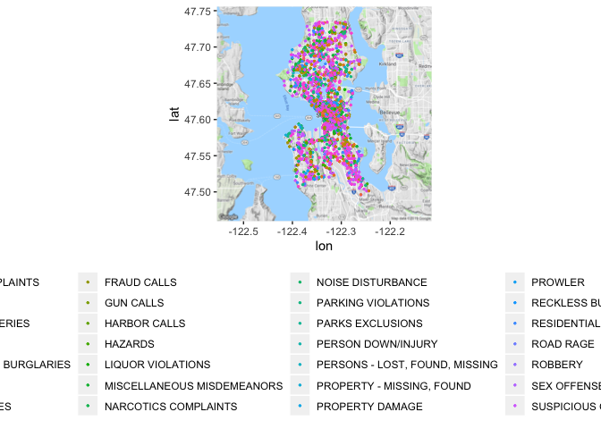
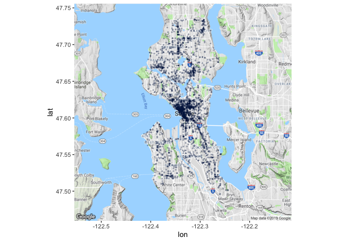
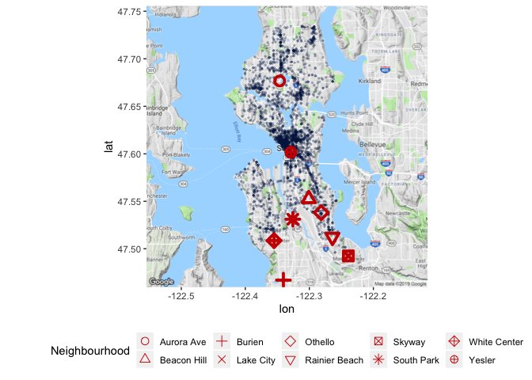
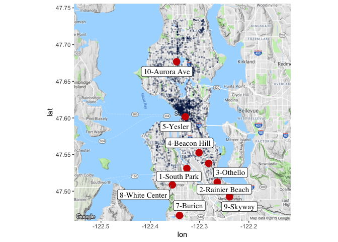
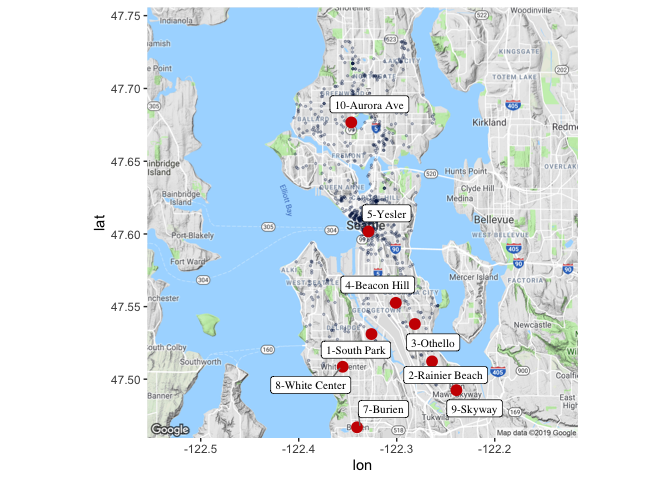
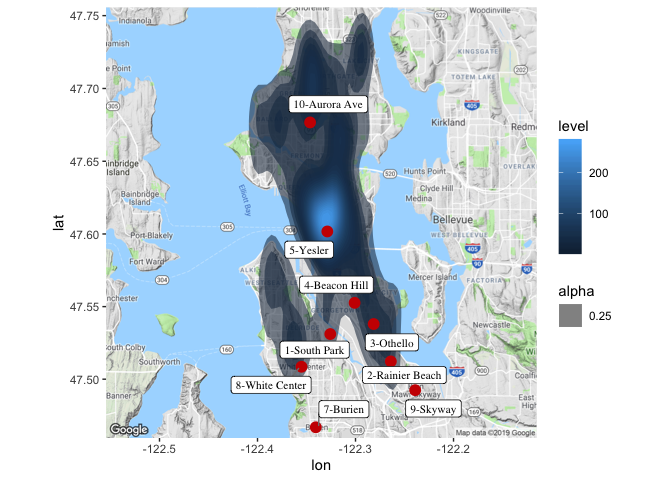
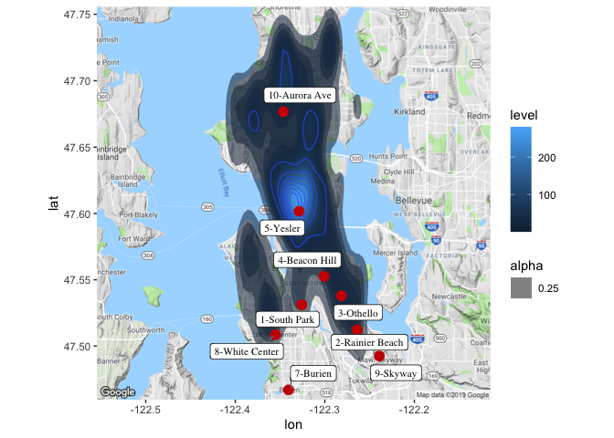
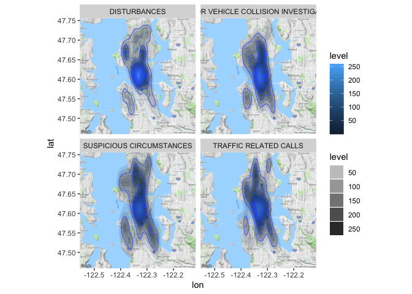
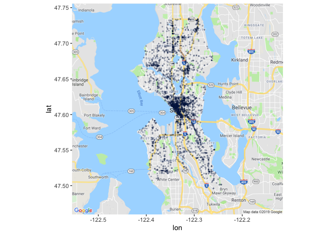
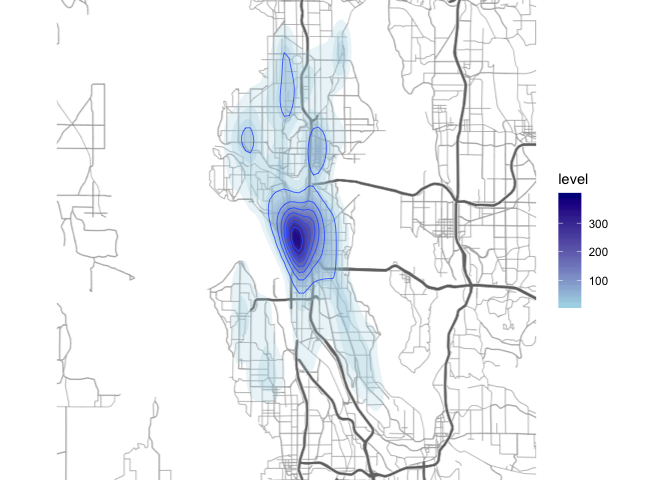

Tutorial
--------

The full tutorial and description is available at [littlemissdata.com](https://www.littlemissdata.com/blog/maps)

Install and Load Packages
-------------------------

Load and look at data
---------------------

``` r
#A) Download the main crime incident dataset

incidents= read.csv('https://raw.githubusercontent.com/lgellis/MiscTutorial/master/ggmap/i2Sample.csv', stringsAsFactors = FALSE)
dim(incidents)
```

    ## [1] 50000    20

``` r
set.seed(101)
sample <- sample.split(incidents, SplitRatio = .25)
incidents<- subset(incidents, sample == TRUE)
dim(incidents)
```

    ## [1] 12500    20

``` r
#B) Download the extra dataset with the most dangerous Seattle cities as per:

# https://housely.com/dangerous-neighborhoods-seattle/

n <- read.csv('https://raw.githubusercontent.com/lgellis/MiscTutorial/master/ggmap/n.csv', stringsAsFactors = FALSE)

# Look at the data sets

dim(incidents)
```

    ## [1] 12500    20

``` r
head(incidents)
```

    ##          X CAD.CDW.ID CAD.Event.Number General.Offense.Number
    ## 2  1028516    1002946      12000438147             2012438147
    ## 5    32080      48491      10000294206             2010294206
    ## 6   326478     681155      11000387576             2011387576
    ## 18  653685    1292063      13000023702              201323702
    ## 20 1361207    1085826      15000149564             2015149564
    ## 22 1131509    1865430      16000390743             2016390743
    ##    Event.Clearance.Code      Event.Clearance.Description
    ## 2                   100 FRAUD (INCLUDING IDENTITY THEFT)
    ## 5                   281               SUSPICIOUS VEHICLE
    ## 6                   250    MISCHIEF, NUISANCE COMPLAINTS
    ## 18                  280                SUSPICIOUS PERSON
    ## 20                  280                SUSPICIOUS PERSON
    ## 22                  073                    AUTO RECOVERY
    ##         Event.Clearance.SubGroup    Event.Clearance.Group
    ## 2                    FRAUD CALLS              FRAUD CALLS
    ## 5       SUSPICIOUS CIRCUMSTANCES SUSPICIOUS CIRCUMSTANCES
    ## 6  NUISANCE, MISCHIEF COMPLAINTS      NUISANCE, MISCHIEF 
    ## 18      SUSPICIOUS CIRCUMSTANCES SUSPICIOUS CIRCUMSTANCES
    ## 20      SUSPICIOUS CIRCUMSTANCES SUSPICIOUS CIRCUMSTANCES
    ## 22               AUTO RECOVERIES              AUTO THEFTS
    ##      Event.Clearance.Date       Hundred.Block.Location District.Sector
    ## 2  12/24/2012 11:14:00 AM    27XX BLOCK OF ALKI AVE SW               W
    ## 5  08/23/2010 01:06:00 AM 23XX BLOCK OF LAKE PARK DR S               R
    ## 6  12/01/2011 11:36:00 PM               3 AV / PIKE ST               K
    ## 18 01/21/2013 12:10:00 PM   RAINIER AV S / S GARDEN ST               R
    ## 20 05/07/2015 04:52:00 PM  84XX BLOCK OF SEAVIEW PL NW               J
    ## 22 10/28/2016 07:29:22 PM        87XX BLOCK OF 14 AV S               F
    ##    Zone.Beat Census.Tract Longitude Latitude
    ## 2         W1    9701.2000 -122.4100 47.57932
    ## 5         R1    9500.3001 -122.2882 47.58018
    ## 6         K1    8100.2010 -122.3378 47.60975
    ## 18        R3   11101.1005 -122.2704 47.53764
    ## 20        J1    3100.5006 -122.4018 47.68924
    ## 22        F3   11200.3015 -122.3147 47.52490
    ##                 Incident.Location
    ## 2  (47.579317217, -122.409989598)
    ## 5  (47.580182752, -122.288159086)
    ## 6  (47.609748462, -122.337793005)
    ## 18   (47.5376416, -122.270434958)
    ## 20  (47.689241732, -122.40180238)
    ## 22          (47.5249, -122.31472)
    ##                           Initial.Type.Description Initial.Type.Subgroup
    ## 2          TRU - FORGERY/CHKS/BUNCO/SCAMS/ID THEFT           FRAUD CALLS
    ## 5                                                                       
    ## 6                                                                       
    ## 18                                                                      
    ## 20 HAZ - POTENTIAL THRT TO PHYS SAFETY (NO HAZMAT)               HAZARDS
    ## 22                                   AUTO RECOVERY           AUTO THEFTS
    ##    Initial.Type.Group          At.Scene.Time
    ## 2         FRAUD CALLS 12/24/2012 10:33:00 AM
    ## 5                                           
    ## 6                                           
    ## 18                                          
    ## 20            HAZARDS                       
    ## 22    AUTO RECOVERIES 10/28/2016 05:26:23 PM

``` r
attach(incidents)

dim(n)
```

    ## [1] 10  4

``` r
head(n)
```

    ##           x        y      Location Rank
    ## 1 -122.3257 47.53109    South Park    1
    ## 2 -122.2640 47.51226 Rainier Beach    2
    ## 3 -122.2815 47.53800       Othello    3
    ## 4 -122.3009 47.55259   Beacon Hill    4
    ## 5 -122.3288 47.60172        Yesler    5
    ## 6  122.2952 47.71929     Lake City    6

``` r
attach(n)

# Create some color variables for graphing later

col1 = "#011f4b"

col2 = "#6497b1"

col3 = "#b3cde0"

col4 = "#CC0000"
```

Transform Variables
-------------------

``` r
#add year to the incidents data frame
incidents$ymd <-mdy_hms(Event.Clearance.Date)
incidents$year <- year(incidents$ymd)

#Create a more manageable data frame with only 2017 and 2018 data
i2 <- incidents %>% 
  filter(year>=2017 & year<=2018)

#Only include complete cases
i2 <- i2[complete.cases(i2), ]

#create a display label to the n data frame (dangerous neighbourhoods)
n$label <-paste(Rank, Location, sep="-")
```

Install and Load ggmap
======================

``` r
#More Q&A - https://github.com/dkahle/ggmap/issues/51

#Get the latest Install
#if(!requireNamespace("devtools")) install.packages("devtools")
#devtools::install_github("dkahle/ggmap", ref = "tidyup", force=TRUE)

#Load the library
library("ggmap")
```

    ## Google's Terms of Service: https://cloud.google.com/maps-platform/terms/.

    ## Please cite ggmap if you use it! See citation("ggmap") for details.

``` r
#NEW working 
# ggmap::register_google(key = "UNCOMMENT AND ENTER KEY HERE")
```

``` r
##1) Create a map with all of the crime locations plotted.

p <- ggmap(get_googlemap(center = c(lon = -122.335167, lat = 47.608013),
                    zoom = 11, scale = 2,
                    maptype ='terrain',
                    color = 'color'))
```

    ## Source : https://maps.googleapis.com/maps/api/staticmap?center=47.608013,-122.335167&zoom=11&size=640x640&scale=2&maptype=terrain&key=xxx

``` r
p + geom_point(aes(x = Longitude, y = Latitude,  colour = Initial.Type.Group), data = i2, size = 0.5) + 
  theme(legend.position="bottom")
```



``` r
##2) Deal with the heavy population by using alpha to make the points transparent.

p +   geom_point(aes(x = Longitude, y = Latitude), colour = col1, data = i2, alpha=0.25, size = 0.5) + 
  theme(legend.position="none")
```



``` r
# #3) Do the same as above, but use the shape to identify the "most dangerous" neighbourhoods.

n$Neighbourhood <- factor(n$Location)
p + geom_point(aes(x = Longitude, y = Latitude), colour = col1, data = i2, alpha=0.25, size = 0.5) + 
  theme(legend.position="bottom")  +
  geom_point(aes(x = x, y = y, shape=Neighbourhood, stroke = 2), colour=col4, data = n, size =3) + 
  scale_shape_manual(values=1:nlevels(n$Neighbourhood)) 
```

    ## Warning: Removed 1 rows containing missing values (geom_point).



``` r
## 4a) Need to use geom_label_repel since there are multiple layers using different data sets.

p + geom_point(aes(x = Longitude, y = Latitude), colour = col1, data = i2, alpha=0.25, size = 0.5) + 
  theme(legend.position="bottom")  +
  geom_point(aes(x = x, y = y, stroke = 2), colour=col4, data = n, size =2.5) + 
  geom_label_repel(
    aes(x, y, label = label),
    data=n,
    family = 'Times', 
    size = 4, 
    box.padding = 0.2, point.padding = 0.3,
    segment.color = 'grey50') 
```

    ## Warning: Removed 1 rows containing missing values (geom_point).

    ## Warning: Removed 1 rows containing missing values (geom_label_repel).

    ## Warning in min(x): no non-missing arguments to min; returning Inf

    ## Warning in max(x): no non-missing arguments to max; returning -Inf

    ## Warning in min(x): no non-missing arguments to min; returning Inf

    ## Warning in max(x): no non-missing arguments to max; returning -Inf



``` r
## 5) Do a more fair check to see if the neighbourhoods are more "dangerous" b/c of dangerous
# crimes (vs all incidents)

unique(i2$Event.Clearance.Group)
```

    ##  [1] "TRAFFIC RELATED CALLS"                
    ##  [2] "SUSPICIOUS CIRCUMSTANCES"             
    ##  [3] "DISTURBANCES"                         
    ##  [4] "CAR PROWL"                            
    ##  [5] "SHOPLIFTING"                          
    ##  [6] "MOTOR VEHICLE COLLISION INVESTIGATION"
    ##  [7] "HAZARDS"                              
    ##  [8] "ASSAULTS"                             
    ##  [9] "MISCELLANEOUS MISDEMEANORS"           
    ## [10] "BURGLARY"                             
    ## [11] "FRAUD CALLS"                          
    ## [12] "FALSE ALACAD"                         
    ## [13] "TRESPASS"                             
    ## [14] "LIQUOR VIOLATIONS"                    
    ## [15] "NUISANCE, MISCHIEF"                   
    ## [16] "BEHAVIORAL HEALTH"                    
    ## [17] "OTHER PROPERTY"                       
    ## [18] "NARCOTICS COMPLAINTS"                 
    ## [19] "PROPERTY - MISSING, FOUND"            
    ## [20] "THREATS, HARASSMENT"                  
    ## [21] "AUTO THEFTS"                          
    ## [22] "ARREST"                               
    ## [23] "ROBBERY"                              
    ## [24] "PROPERTY DAMAGE"                      
    ## [25] "RECKLESS BURNING"                     
    ## [26] "PERSON DOWN/INJURY"                   
    ## [27] "PERSONS - LOST, FOUND, MISSING"       
    ## [28] "ANIMAL COMPLAINTS"                    
    ## [29] "OTHER VICE"                           
    ## [30] "HARBOR CALLS"                         
    ## [31] "WEAPONS CALLS"                        
    ## [32] "DRIVE BY (NO INJURY)"                 
    ## [33] "LEWD CONDUCT"                         
    ## [34] "PROWLER"                              
    ## [35] "PROSTITUTION"                         
    ## [36] "FAILURE TO REGISTER (SEX OFFENDER)"   
    ## [37] "BIKE"                                 
    ## [38] "PUBLIC GATHERINGS"                    
    ## [39] "HOMICIDE"

``` r
i2Dangerous <-filter(i2, Event.Clearance.Group %in% c('TRESPASS', 'ASSAULTS', 'SUSPICIOUS CIRCUMSTANCES', 
                                                      'BURGLARY', 'PROWLER', 'ASSAULTS', 'PROPERTY DAMAGE', 
                                                      'ARREST', 'NARCOTICS COMPLAINTS','THREATS', 'HARASSMENT', 'WEAPONS CALLS',
                                                      'PROSTITUTION' , 'ROBBERY', 'FAILURE TO REGISTER (SEX OFFENDER)', 'LEWD CONDUCT', 
                                                      'HOMICIDE'))
attach(i2Dangerous)
```

    ## The following objects are masked from incidents:
    ## 
    ##     At.Scene.Time, CAD.CDW.ID, CAD.Event.Number, Census.Tract,
    ##     District.Sector, Event.Clearance.Code, Event.Clearance.Date,
    ##     Event.Clearance.Description, Event.Clearance.Group,
    ##     Event.Clearance.SubGroup, General.Offense.Number,
    ##     Hundred.Block.Location, Incident.Location,
    ##     Initial.Type.Description, Initial.Type.Group,
    ##     Initial.Type.Subgroup, Latitude, Longitude, X, Zone.Beat

``` r
p + geom_point(aes(x = Longitude, y = Latitude), colour = col1, data = i2Dangerous, alpha=0.25, size = 0.5) + 
  theme(legend.position="bottom")  +
  geom_point(aes(x = x, y = y, stroke = 2), colour=col4, data = n, size =1.5) + 
  geom_label_repel(
    aes(x, y, label = label),
    data=n,
    family = 'Times', 
    size = 3, 
    box.padding = 0.2, point.padding = 0.3,
    segment.color = 'grey50') 
```

    ## Warning: Removed 1 rows containing missing values (geom_point).

    ## Warning: Removed 1 rows containing missing values (geom_label_repel).

    ## Warning in min(x): no non-missing arguments to min; returning Inf

    ## Warning in max(x): no non-missing arguments to max; returning -Inf

    ## Warning in min(x): no non-missing arguments to min; returning Inf

    ## Warning in max(x): no non-missing arguments to max; returning -Inf



``` r
## 6) View in a density Plot
p + stat_density2d(
    aes(x = Longitude, y = Latitude, fill = ..level.., alpha = 0.25),
    size = 0.01, bins = 30, data = i2Dangerous,
    geom = "polygon"
  ) +
  geom_point(aes(x = x, y = y, stroke = 2), colour=col4, data = n, size =1.5) + 
  geom_label_repel(
    aes(x, y, label = label),
    data=n,
    family = 'Times', 
    size = 3, 
    box.padding = 0.2, point.padding = 0.3,
    segment.color = 'grey50') 
```

    ## Warning: Removed 1 rows containing missing values (geom_point).

    ## Warning: Removed 1 rows containing missing values (geom_label_repel).

    ## Warning in min(x): no non-missing arguments to min; returning Inf

    ## Warning in max(x): no non-missing arguments to max; returning -Inf

    ## Warning in min(x): no non-missing arguments to min; returning Inf

    ## Warning in max(x): no non-missing arguments to max; returning -Inf



``` r
#7)  Density with  alpha set to level
## have to make a lot of bins given the difference in volumes. Add geom_density to put in grid lines
p + stat_density2d(
    aes(x = Longitude, y = Latitude, fill = ..level.., alpha = 0.25),
    size = 0.1, bins = 40, data = i2Dangerous,
    geom = "polygon"
  ) +
  geom_density2d(data = i2, 
               aes(x = Longitude, y = Latitude), size = 0.3) +
  geom_point(aes(x = x, y = y, stroke = 2), colour=col4, data = n, size =1.5)+ 
  geom_label_repel(
    aes(x, y, label = label),
    data=n,
    family = 'Times', 
    size = 3, 
    box.padding = 0.2, point.padding = 0.3,
    segment.color = 'grey50') 
```

    ## Warning: Removed 1 rows containing missing values (geom_point).

    ## Warning: Removed 1 rows containing missing values (geom_label_repel).

    ## Warning in min(x): no non-missing arguments to min; returning Inf

    ## Warning in max(x): no non-missing arguments to max; returning -Inf

    ## Warning in min(x): no non-missing arguments to min; returning Inf

    ## Warning in max(x): no non-missing arguments to max; returning -Inf



``` r
#8) Density chart with graph lines and facet wrap
i2Sub <-filter(i2, Event.Clearance.Group %in% c('TRAFFIC RELATED CALLS', 'DISTURBANCES', 'SUSPICIOUS CIRCUMSTANCES', 'MOTOR VEHICLE COLLISION INVESTIGATION'))
dim(i2Sub)
```

    ## [1] 1446   22

``` r
attach(i2Sub)
```

    ## The following objects are masked from i2Dangerous:
    ## 
    ##     At.Scene.Time, CAD.CDW.ID, CAD.Event.Number, Census.Tract,
    ##     District.Sector, Event.Clearance.Code, Event.Clearance.Date,
    ##     Event.Clearance.Description, Event.Clearance.Group,
    ##     Event.Clearance.SubGroup, General.Offense.Number,
    ##     Hundred.Block.Location, Incident.Location,
    ##     Initial.Type.Description, Initial.Type.Group,
    ##     Initial.Type.Subgroup, Latitude, Longitude, X, year, ymd,
    ##     Zone.Beat

    ## The following objects are masked from incidents:
    ## 
    ##     At.Scene.Time, CAD.CDW.ID, CAD.Event.Number, Census.Tract,
    ##     District.Sector, Event.Clearance.Code, Event.Clearance.Date,
    ##     Event.Clearance.Description, Event.Clearance.Group,
    ##     Event.Clearance.SubGroup, General.Offense.Number,
    ##     Hundred.Block.Location, Incident.Location,
    ##     Initial.Type.Description, Initial.Type.Group,
    ##     Initial.Type.Subgroup, Latitude, Longitude, X, Zone.Beat

``` r
p + stat_density2d(
    aes(x = Longitude, y = Latitude, fill = ..level.., alpha =..level..),
    size = 0.2, bins = 30, data = i2Sub,
    geom = "polygon"
  ) +
  geom_density2d(data = i2Sub, 
                 aes(x = Longitude, y = Latitude), size = 0.3) +
  facet_wrap(~ Event.Clearance.Group, nrow=2)
```



``` r
#9a) roadmap + black geom_point
p <- ggmap(get_googlemap(center = c(lon = -122.335167, lat = 47.608013),
                    zoom = 11, scale = 2,
                    maptype ='roadmap',
                    color = 'color'))
```

    ## Source : https://maps.googleapis.com/maps/api/staticmap?center=47.608013,-122.335167&zoom=11&size=640x640&scale=2&maptype=roadmap&key=xxx

``` r
p +   geom_point(aes(x = Longitude, y = Latitude), colour = col1, data = i2, alpha=0.25, size = 0.5) + 
  theme(legend.position="none")
```



``` r
#9b) satellite + red geom_point

p <- ggmap(get_googlemap(center = c(lon = -122.335167, lat = 47.608013),
                    zoom = 11, scale = 2,
                    maptype ='satellite',
                    color = 'color'))
```

    ## Source : https://maps.googleapis.com/maps/api/staticmap?center=47.608013,-122.335167&zoom=11&size=640x640&scale=2&maptype=satellite&key=xxx

``` r
p + geom_point(aes(x = Longitude, y = Latitude), colour = col4, data = i2, alpha=0.3, size = 0.5) + 
  theme(legend.position="none")
```


``` r
# 10) Use qmap to change the chart provider to stamen - do maptype = "watercolor", "terrain-lines'
# 10a) terrain-lines + blue density 
# Note: see update if you run into issues.
center = c(lon = -122.335167, lat = 47.608013)
qmap(center, zoom = 11, source = "stamen", maptype = "terrain-lines") +
  stat_density2d(
    aes(x = Longitude, y = Latitude, fill = ..level..),
    alpha = 0.25, size = 0.2, bins = 30, data = i2,
    geom = "polygon"
  )  + geom_density2d(data = i2, 
                 aes(x = Longitude, y = Latitude), size = 0.3) +
  scale_fill_gradient(low = "light blue", high= "dark blue") 
```

    ## Source : https://maps.googleapis.com/maps/api/staticmap?center=47.608013,-122.335167&zoom=11&size=640x640&scale=2&maptype=terrain&key=xxx

    ## Source : http://tile.stamen.com/terrain-lines/11/326/713.png

    ## Source : http://tile.stamen.com/terrain-lines/11/327/713.png

    ## Source : http://tile.stamen.com/terrain-lines/11/328/713.png

    ## Source : http://tile.stamen.com/terrain-lines/11/329/713.png

    ## Source : http://tile.stamen.com/terrain-lines/11/326/714.png

    ## Source : http://tile.stamen.com/terrain-lines/11/327/714.png

    ## Source : http://tile.stamen.com/terrain-lines/11/328/714.png

    ## Source : http://tile.stamen.com/terrain-lines/11/329/714.png

    ## Source : http://tile.stamen.com/terrain-lines/11/326/715.png

    ## Source : http://tile.stamen.com/terrain-lines/11/327/715.png

    ## Source : http://tile.stamen.com/terrain-lines/11/328/715.png

    ## Source : http://tile.stamen.com/terrain-lines/11/329/715.png

    ## Source : http://tile.stamen.com/terrain-lines/11/326/716.png

    ## Source : http://tile.stamen.com/terrain-lines/11/327/716.png

    ## Source : http://tile.stamen.com/terrain-lines/11/328/716.png

    ## Source : http://tile.stamen.com/terrain-lines/11/329/716.png



``` r
# 10b) watercolor + red geom_point
center = c(lon = -122.335167, lat = 47.608013)
qmap(center, zoom = 11, source = "stamen", maptype = "watercolor") +
  geom_point(aes(x = Longitude, y = Latitude), colour = col4, data = i2, alpha=0.3, size = 0.5) + 
  theme(legend.position="none")
```

    ## Source : https://maps.googleapis.com/maps/api/staticmap?center=47.608013,-122.335167&zoom=11&size=640x640&scale=2&maptype=terrain&key=xxx

    ## Source : http://tile.stamen.com/watercolor/11/326/713.jpg

    ## Source : http://tile.stamen.com/watercolor/11/327/713.jpg

    ## Source : http://tile.stamen.com/watercolor/11/328/713.jpg

    ## Source : http://tile.stamen.com/watercolor/11/329/713.jpg

    ## Source : http://tile.stamen.com/watercolor/11/326/714.jpg

    ## Source : http://tile.stamen.com/watercolor/11/327/714.jpg

    ## Source : http://tile.stamen.com/watercolor/11/328/714.jpg

    ## Source : http://tile.stamen.com/watercolor/11/329/714.jpg

    ## Source : http://tile.stamen.com/watercolor/11/326/715.jpg

    ## Source : http://tile.stamen.com/watercolor/11/327/715.jpg

    ## Source : http://tile.stamen.com/watercolor/11/328/715.jpg

    ## Source : http://tile.stamen.com/watercolor/11/329/715.jpg

    ## Source : http://tile.stamen.com/watercolor/11/326/716.jpg

    ## Source : http://tile.stamen.com/watercolor/11/327/716.jpg

    ## Source : http://tile.stamen.com/watercolor/11/328/716.jpg

    ## Source : http://tile.stamen.com/watercolor/11/329/716.jpg


