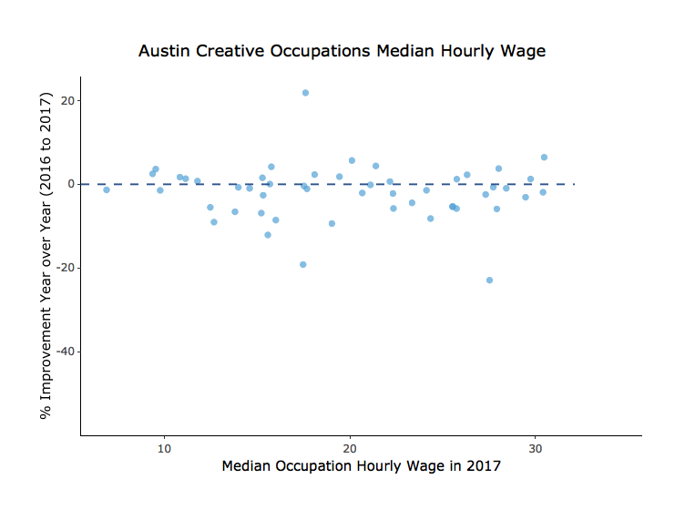

Install and Load Packages
-------------------------

``` r
#installs for the tutorial
#install.packages("plotly")
#install.packages("tidyverse")
#install.packages("htmlwidgets")

#installs for the rmd file
#install.packages("webshot") 
#webshot::install_phantomjs()

library(plotly)
```

    ## Loading required package: ggplot2

    ## 
    ## Attaching package: 'plotly'

    ## The following object is masked from 'package:ggplot2':
    ## 
    ##     last_plot

    ## The following object is masked from 'package:stats':
    ## 
    ##     filter

    ## The following object is masked from 'package:graphics':
    ## 
    ##     layout

``` r
library(tidyverse)
```

    ## ── Attaching packages ─────────────────────────────────────────────────────────────────────────── tidyverse 1.2.1 ──

    ## ✔ tibble  2.0.1     ✔ purrr   0.3.0
    ## ✔ tidyr   0.8.2     ✔ dplyr   0.7.8
    ## ✔ readr   1.2.1     ✔ stringr 1.4.0
    ## ✔ tibble  2.0.1     ✔ forcats 0.3.0

    ## ── Conflicts ────────────────────────────────────────────────────────────────────────────── tidyverse_conflicts() ──
    ## ✖ dplyr::filter() masks plotly::filter(), stats::filter()
    ## ✖ dplyr::lag()    masks stats::lag()

``` r
library(htmlwidgets)
```

Import Data
-----------

``` r
creatives <- read.csv(file="https://raw.githubusercontent.com/lgellis/MiscTutorial/master/ggplotly/Median_Earnings_of_Creative_Sector_Occupations__CLL.B.1.csv",
                      header=TRUE, sep=",", stringsAsFactors = FALSE)

head(creatives)
```

    ##   SOC.Code
    ## 1  11-2011
    ## 2  13-1011
    ## 3  25-1099
    ## 4  25-4011
    ## 5  25-4012
    ## 6  25-4013
    ##                                                          Occupation
    ## 1                               Advertising and promotions managers
    ## 2 Agents and business managers of artists, performers, and athletes
    ## 3                                            Postsecondary teachers
    ## 4                                                        Archivists
    ## 5                                                          Curators
    ## 6                               Museum technicians and conservators
    ##   X2016.Median.hourly.earnings X2017.Median.hourly.earnings
    ## 1                        30.11                        29.73
    ## 2                        21.83                        22.31
    ## 3                        26.92                        26.31
    ## 4                        26.66                        27.31
    ## 5                        32.56                        30.46
    ## 6                        24.33                        25.74

Format Data and create interactive scatterplot
----------------------------------------------

``` r
##### Data processing
#Rename the columns and create a new column for year over year change

creatives <- creatives %>% 
  rename(Median_2016 = X2016.Median.hourly.earnings, Median_2017 = X2017.Median.hourly.earnings) %>% 
  rowwise() %>% 
  mutate(Percent_Improvement = round((Median_2017-Median_2016)/Median_2016*100,2)) 


##### Create a scatterPlot
#Note - The chart is not interactive in .md format.  Please view on littlemissdata.com/blog/interactiveplots

scatterPlot <- creatives %>% 
  ggplot(aes(x = Median_2017, y = Percent_Improvement)) + 
  geom_point(alpha=0.7, colour = "#51A0D5") + 
  labs(x = "Median Occupation Hourly Wage in 2017", 
       y = "% Improvement Year over Year (2016 to 2017)",
       title = "Austin Creative Occupations Median Hourly Wage") +
  geom_hline(yintercept=0, linetype="dashed", color = "#2C528C", size=0.5) +
  theme_classic()

ggplotly(scatterPlot)
```



Adding text formatting for the mouseover
----------------------------------------

``` r
#Note - The chart is not interactive in .md format.  Please view on littlemissdata.com/blog/interactiveplots
scatterPlot <- creatives %>% 
  ggplot(aes(x = Median_2017, y = Percent_Improvement, 
             text = paste(
               "Occupation: ", Occupation, "\n",
                          "2017: ", Median_2017, "\n",
                          "2016: ", Median_2016, "\n",
                          "% Improvement Year over Year: ", Percent_Improvement, "\n",
                          sep = ""
               ))) + 
  geom_point(alpha=0.7, colour = "#51A0D5") + 
  labs(x = "Median Occupation Hourly Wage in 2017", 
       y = "% Improvement Year over Year (2016 to 2017)",
       title = "Austin Creative Occupations Median Hourly Wage") +
  geom_hline(yintercept=0, linetype="dashed", color = "#2C528C", size=0.5) +
  theme_classic()

ggplotly(scatterPlot, tooltip = "text")
```


System Information
------------------

``` r
sessionInfo() 
```

    ## R version 3.5.2 (2018-12-20)
    ## Platform: x86_64-apple-darwin15.6.0 (64-bit)
    ## Running under: macOS High Sierra 10.13.6
    ## 
    ## Matrix products: default
    ## BLAS: /Library/Frameworks/R.framework/Versions/3.5/Resources/lib/libRblas.0.dylib
    ## LAPACK: /Library/Frameworks/R.framework/Versions/3.5/Resources/lib/libRlapack.dylib
    ## 
    ## locale:
    ## [1] en_US.UTF-8/en_US.UTF-8/en_US.UTF-8/C/en_US.UTF-8/en_US.UTF-8
    ## 
    ## attached base packages:
    ## [1] stats     graphics  grDevices utils     datasets  methods   base     
    ## 
    ## other attached packages:
    ##  [1] bindrcpp_0.2.2  htmlwidgets_1.3 forcats_0.3.0   stringr_1.4.0  
    ##  [5] dplyr_0.7.8     purrr_0.3.0     readr_1.2.1     tidyr_0.8.2    
    ##  [9] tibble_2.0.1    tidyverse_1.2.1 plotly_4.8.0    ggplot2_3.1.0  
    ## 
    ## loaded via a namespace (and not attached):
    ##  [1] Rcpp_1.0.0        lubridate_1.7.4   lattice_0.20-38  
    ##  [4] ps_1.3.0          assertthat_0.2.0  digest_0.6.18    
    ##  [7] mime_0.6          R6_2.4.0          cellranger_1.1.0 
    ## [10] plyr_1.8.4        backports_1.1.2   evaluate_0.13    
    ## [13] httr_1.4.0        pillar_1.3.1      rlang_0.3.1      
    ## [16] lazyeval_0.2.1    readxl_1.1.0      rstudioapi_0.9.0 
    ## [19] data.table_1.11.8 callr_3.1.1       rmarkdown_1.11   
    ## [22] labeling_0.3      webshot_0.5.1     munsell_0.5.0    
    ## [25] shiny_1.2.0       broom_0.5.1       compiler_3.5.2   
    ## [28] httpuv_1.4.5.1    modelr_0.1.2      xfun_0.5         
    ## [31] pkgconfig_2.0.2   htmltools_0.3.6   tidyselect_0.2.5 
    ## [34] viridisLite_0.3.0 crayon_1.3.4      withr_2.1.2      
    ## [37] later_0.8.0       grid_3.5.2        nlme_3.1-137     
    ## [40] jsonlite_1.6      xtable_1.8-3      gtable_0.2.0     
    ## [43] magrittr_1.5      scales_1.0.0      cli_1.0.1        
    ## [46] stringi_1.3.1     promises_1.0.1    xml2_1.2.0       
    ## [49] generics_0.0.2    tools_3.5.2       Cairo_1.5-9      
    ## [52] glue_1.3.0        hms_0.4.2         crosstalk_1.0.0  
    ## [55] processx_3.2.1    yaml_2.2.0        colorspace_1.4-0 
    ## [58] rvest_0.3.2       knitr_1.21        bindr_0.1.1      
    ## [61] haven_2.0.0
