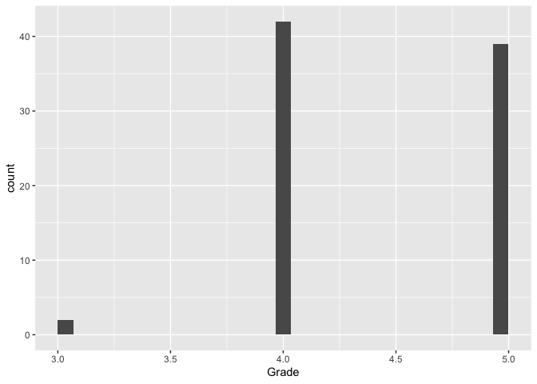
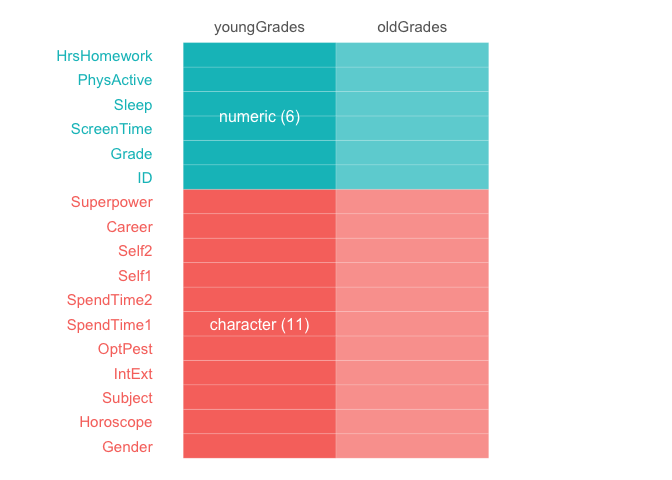
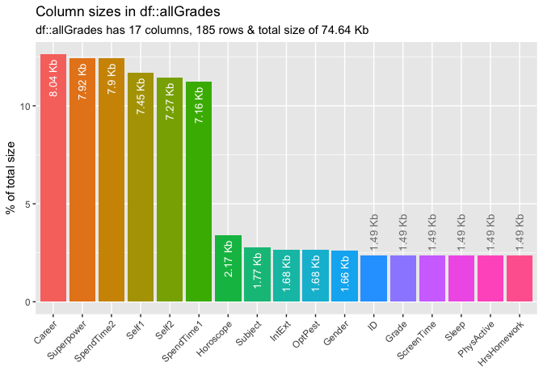
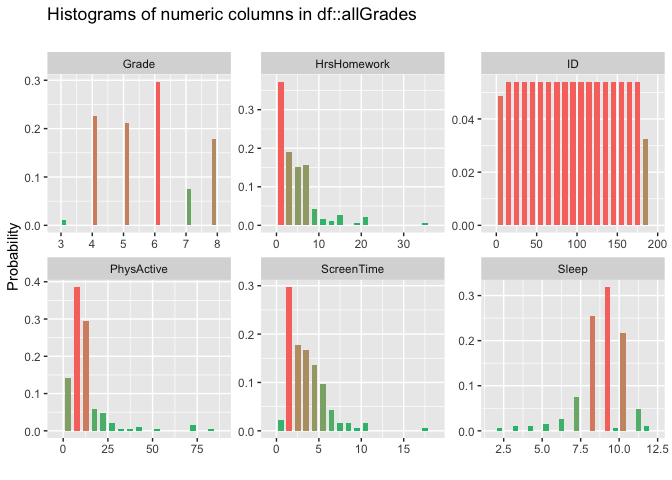
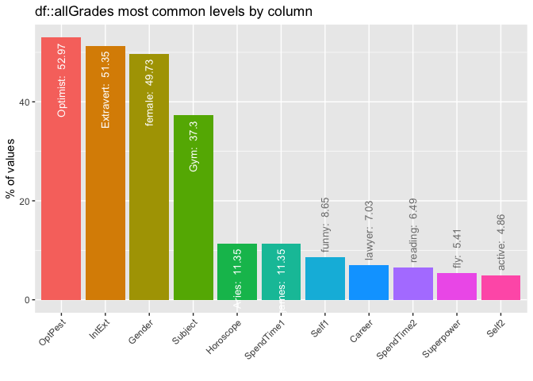
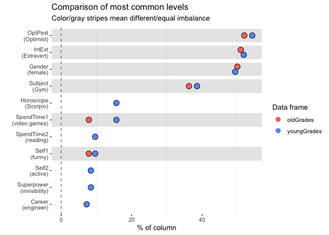
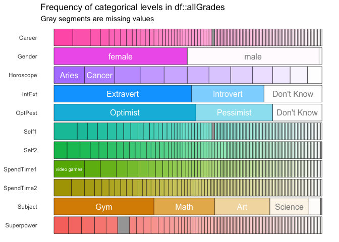
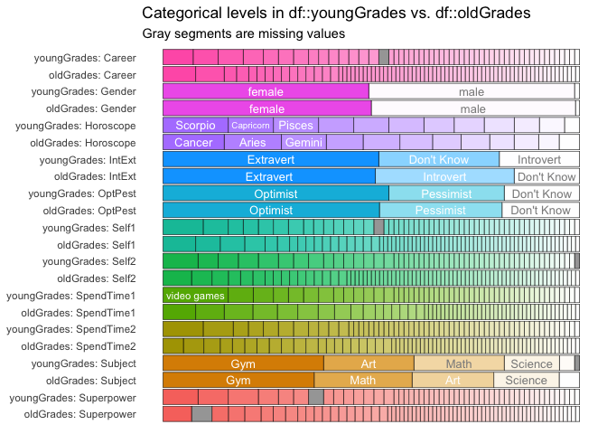

# Install and load the inspectdf package

I like this package because it’s got a lot of functionality and it’s
incredibly straightforward. In short it allows you to understand and
visualize column types, sizes, values, value imbalance & distributions
as well as correlations. Further to this, it allows you to very easily
perform any of the above features for an individual data frame, or to
compare the differences between two data frames.

# Download the data Set from the previous [EDA blog](https://www.littlemissdata.com/blog/simple-eda)

``` r
#Load the readr library to bring in the dataset
#install.packages("readr")
library(readr)

#Download the data set
df= read_csv('https://raw.githubusercontent.com/lgellis/STEM/master/DATA-ART-1/Data/FinalData.csv', col_names = TRUE)
```

    ## Rows: 185 Columns: 17

    ## ── Column specification ────────────────────────────────────────────────────────
    ## Delimiter: ","
    ## chr (11): Gender, Horoscope, Subject, IntExt, OptPest, SpendTime1, SpendTime...
    ## dbl  (6): ID, Grade, ScreenTime, Sleep, PhysActive, HrsHomework

    ## 
    ## ℹ Use `spec()` to retrieve the full column specification for this data.
    ## ℹ Specify the column types or set `show_col_types = FALSE` to quiet this message.

``` r
#Quick view of the data frame
head(df, 10)
```

    ## # A tibble: 10 × 17
    ##       ID Gender Grade Horoscope Subject IntExt     OptPest    ScreenTime Sleep
    ##    <dbl> <chr>  <dbl> <chr>     <chr>   <chr>      <chr>           <dbl> <dbl>
    ##  1     1 male       4 Scorpio   Math    Extravert  Optimist            1     7
    ##  2     2 female     4 Capricorn Gym     Extravert  Optimist            1     8
    ##  3     3 male       4 Taurus    Math    Introvert  Optimist            4     9
    ##  4     4 male       4 Aquarius  Math    Don't Know Don't Know          3     9
    ##  5     5 male       4 Scorpio   Gym     Don't Know Don't Know          1     9
    ##  6     6 male       4 Pisces    Gym     Extravert  Optimist            2     9
    ##  7     7 male       3 Scorpio   Art     Introvert  Optimist            1    11
    ##  8     8 male       6 Taurus    Math    Extravert  Optimist            4     9
    ##  9     9 male       6 Aries     Gym     Introvert  Pessimist           6     8
    ## 10    10 male       6 Pisces    Math    Introvert  Don't Know          3     9
    ## # … with 8 more variables: PhysActive <dbl>, HrsHomework <dbl>,
    ## #   SpendTime1 <chr>, SpendTime2 <chr>, Self1 <chr>, Self2 <chr>, Career <chr>,
    ## #   Superpower <chr>

``` r
dim(df)
```

    ## [1] 185  17

# Create the necessary data frames

We need three data frames. We need one data frame with the complete data
set. We simply rename df to allGrades. We also need two subsetted data
sets to leverage the packages easy data frame comparison features. We
create the data frames oldGrades (6-8) and youngGrades (3-5).

``` r
allGrades <- df

oldGrades <- allGrades %>% 
  filter(Grade > 5)

youngGrades <- allGrades %>% 
  filter(Grade < 6)

ggplot(oldGrades, aes(x=Grade)) + geom_histogram()
```

    ## `stat_bin()` using `bins = 30`. Pick better value with `binwidth`.


``` r
ggplot(youngGrades, aes(x=Grade)) + geom_histogram()
```

    ## `stat_bin()` using `bins = 30`. Pick better value with `binwidth`.



# Run through the functions of the inspectdf package

Simply pass in a dataframe, or two (for comparisons) and set show_plot =
TRUE. The output will include both a tibble with the raw data and a
visualization.

## 1 Evaluate the data frame column types with the inspect_types() function

### a) Evaluate the full data frame: allGrades

``` r
inspect_types(allGrades) %>% show_plot()
```


### b) Compare between youngGrades and oldGrades

``` r
inspect_types(youngGrades, oldGrades) %>% show_plot()
```



## 2 Evaluate the data frame column memory usage with the inspect_mem() function

### a) Evaluate the full data frame: allGrades

``` r
inspect_mem(allGrades) %>% show_plot()
```

    ## Warning: `guides(<scale> = FALSE)` is deprecated. Please use `guides(<scale> =
    ## "none")` instead.



### b) Compare between youngGrades and oldGrades

``` r
inspect_mem(youngGrades, oldGrades) %>% show_plot()
```


## 3 Evaluate the na prevelance within the data frame with the inspect_na() function

### a) Evaluate the full data frame: allGrades

``` r
inspect_na(allGrades) %>% show_plot()
```

    ## Warning: `guides(<scale> = FALSE)` is deprecated. Please use `guides(<scale> =
    ## "none")` instead.


### b) Compare between youngGrades and oldGrades

``` r
inspect_na(youngGrades, oldGrades) %>% show_plot()
```


## 4 Evaluate the distribution of the numerical columns with the inspect_num() function

### a) Evaluate the full data frame: allGrades

``` r
inspect_num(allGrades) %>% show_plot()
```



### b) Compare between youngGrades and oldGrades

``` r
inspect_num(youngGrades, oldGrades) %>% show_plot()
```


## 5 Evaluate for any possible categorical column imbalance with inspect_imb() function to identify factors which might be overly prevalent.

### a) Evaluate the full data frame: allGrades

``` r
inspect_imb(allGrades) %>% show_plot()
```

    ## Warning: `guides(<scale> = FALSE)` is deprecated. Please use `guides(<scale> =
    ## "none")` instead.



### b) Compare between youngGrades and oldGrades

``` r
inspect_imb(youngGrades, oldGrades) %>% show_plot()
```



## 6 Evaluate the categorical column distribution with the inspect_cat() function

### a) Evaluate the full data frame: allGrades

``` r
inspect_cat(allGrades) %>% show_plot()
```



### b) Compare between youngGrades and oldGrades

``` r
inspect_cat(youngGrades, oldGrades) %>% show_plot()
```



## 7 Evaluate the column correlations with the inspect_cor() function

### a) Evaluate the full data frame: allGrades

``` r
inspect_cor(allGrades) %>% show_plot()
```


### b) Compare between youngGrades and oldGrades

``` r
inspect_cor(youngGrades, oldGrades) %>% show_plot()
```


