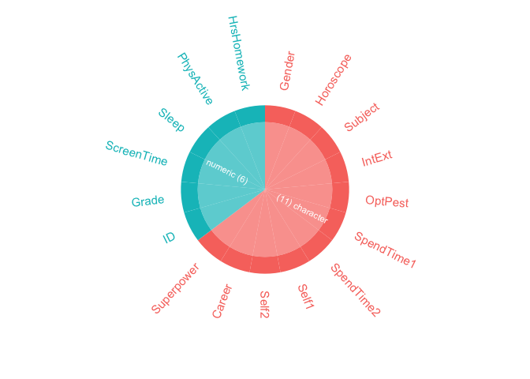
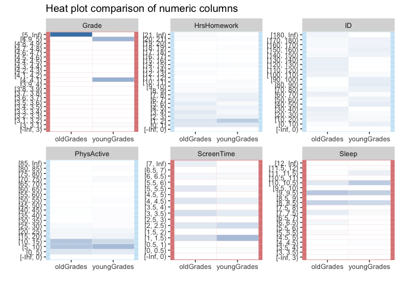
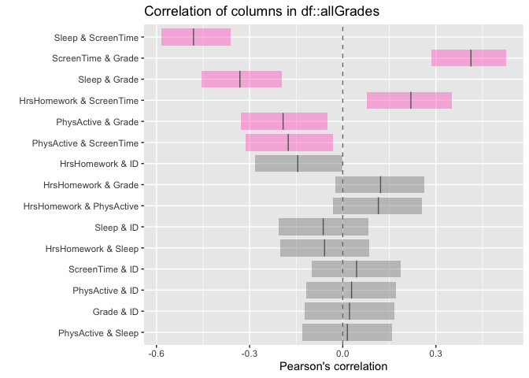

Install and load the inspectdf package
======================================

I like this package because it’s got a lot of functionality and it’s incredibly straightforward. In short it allows you to understand and visualize column types, sizes, values, value imbalance & distributions as well as correlations. Further to this, it allows you to very easily perform any of the above features for an individual data frame, or to compare the differences between two data frames.

Download the data Set from the previous [EDA blog](https://www.littlemissdata.com/blog/simple-eda)
==================================================================================================

``` r
#Load the readr library to bring in the dataset
#install.packages("readr")
library(readr)

#Download the data set
df= read_csv('https://raw.githubusercontent.com/lgellis/STEM/master/DATA-ART-1/Data/FinalData.csv', col_names = TRUE)
```

    ## Parsed with column specification:
    ## cols(
    ##   ID = col_double(),
    ##   Gender = col_character(),
    ##   Grade = col_double(),
    ##   Horoscope = col_character(),
    ##   Subject = col_character(),
    ##   IntExt = col_character(),
    ##   OptPest = col_character(),
    ##   ScreenTime = col_double(),
    ##   Sleep = col_double(),
    ##   PhysActive = col_double(),
    ##   HrsHomework = col_double(),
    ##   SpendTime1 = col_character(),
    ##   SpendTime2 = col_character(),
    ##   Self1 = col_character(),
    ##   Self2 = col_character(),
    ##   Career = col_character(),
    ##   Superpower = col_character()
    ## )

``` r
#Quick view of the data frame
head(df, 10)
```

    ## # A tibble: 10 x 17
    ##       ID Gender Grade Horoscope Subject IntExt OptPest ScreenTime Sleep
    ##    <dbl> <chr>  <dbl> <chr>     <chr>   <chr>  <chr>        <dbl> <dbl>
    ##  1     1 male       4 Scorpio   Math    Extra… Optimi…          1     7
    ##  2     2 female     4 Capricorn Gym     Extra… Optimi…          1     8
    ##  3     3 male       4 Taurus    Math    Intro… Optimi…          4     9
    ##  4     4 male       4 Aquarius  Math    Don't… Don't …          3     9
    ##  5     5 male       4 Scorpio   Gym     Don't… Don't …          1     9
    ##  6     6 male       4 Pisces    Gym     Extra… Optimi…          2     9
    ##  7     7 male       3 Scorpio   Art     Intro… Optimi…          1    11
    ##  8     8 male       6 Taurus    Math    Extra… Optimi…          4     9
    ##  9     9 male       6 Aries     Gym     Intro… Pessim…          6     8
    ## 10    10 male       6 Pisces    Math    Intro… Don't …          3     9
    ## # … with 8 more variables: PhysActive <dbl>, HrsHomework <dbl>,
    ## #   SpendTime1 <chr>, SpendTime2 <chr>, Self1 <chr>, Self2 <chr>,
    ## #   Career <chr>, Superpower <chr>

``` r
dim(df)
```

    ## [1] 185  17

Create the necessary data frames
================================

We need three data frames. We need one data frame with the complete data set. We simply rename df to allGrades. We also need two subsetted data sets to leverage the packages easy data frame comparison features. We create the data frames oldGrades (6-8) and youngGrades (3-5).

``` r
allGrades <- df

oldGrades <- allGrades %>% 
  filter(Grade > 5)

youngGrades <- allGrades %>% 
  filter(Grade < 6)

ggplot(oldGrades, aes(x=Grade)) + geom_histogram()
```

    ## `stat_bin()` using `bins = 30`. Pick better value with `binwidth`.


``` r
ggplot(youngGrades, aes(x=Grade)) + geom_histogram()
```

    ## `stat_bin()` using `bins = 30`. Pick better value with `binwidth`.


Run through the functions of the inspectdf package
==================================================

Simply pass in a dataframe, or two (for comparisons) and set show\_plot = TRUE. The output will include both a tibble with the raw data and a visualization.

1 Evaluate the data frame column types with the inspect\_types() function
-------------------------------------------------------------------------

### a) Evaluate the full data frame: allGrades

``` r
inspect_types(allGrades, show_plot = TRUE)
```



    ## # A tibble: 2 x 4
    ##   type        cnt  pcnt col_name  
    ##   <chr>     <int> <dbl> <list>    
    ## 1 character    11  64.7 <chr [11]>
    ## 2 numeric       6  35.3 <chr [6]>

### b) Compare between youngGrades and oldGrades

``` r
inspect_types(youngGrades, oldGrades, show_plot = TRUE)
```


    ## # A tibble: 2 x 5
    ##   type      cnt_1 pcnt_1 cnt_2 pcnt_2
    ##   <chr>     <int>  <dbl> <int>  <dbl>
    ## 1 character    11   64.7    11   64.7
    ## 2 numeric       6   35.3     6   35.3

2 Evaluate the data frame column memory usage with the inspect\_mem() function
------------------------------------------------------------------------------

### a) Evaluate the full data frame: allGrades

``` r
inspect_mem(allGrades, show_plot = TRUE)
```


    ## # A tibble: 17 x 3
    ##    col_name    size     pcnt
    ##    <chr>       <chr>   <dbl>
    ##  1 Career      8.04 Kb 12.6 
    ##  2 Superpower  7.92 Kb 12.4 
    ##  3 SpendTime2  7.9 Kb  12.4 
    ##  4 Self1       7.45 Kb 11.7 
    ##  5 Self2       7.27 Kb 11.4 
    ##  6 SpendTime1  7.16 Kb 11.2 
    ##  7 Horoscope   2.17 Kb  3.41
    ##  8 Subject     1.77 Kb  2.77
    ##  9 IntExt      1.68 Kb  2.64
    ## 10 OptPest     1.68 Kb  2.64
    ## 11 Gender      1.66 Kb  2.61
    ## 12 ID          1.49 Kb  2.34
    ## 13 Grade       1.49 Kb  2.34
    ## 14 ScreenTime  1.49 Kb  2.34
    ## 15 Sleep       1.49 Kb  2.34
    ## 16 PhysActive  1.49 Kb  2.34
    ## 17 HrsHomework 1.49 Kb  2.34

### b) Compare between youngGrades and oldGrades

``` r
inspect_mem(youngGrades, oldGrades, show_plot = TRUE)
```


    ## # A tibble: 17 x 5
    ##    col_name    size_1    size_2    pcnt_1 pcnt_2
    ##    <chr>       <chr>     <chr>      <dbl>  <dbl>
    ##  1 SpendTime2  4.09 Kb   4.8 Kb     12.8   12.1 
    ##  2 Career      3.91 Kb   5.33 Kb    12.2   13.4 
    ##  3 Superpower  3.85 Kb   5.02 Kb    12.0   12.7 
    ##  4 Self1       3.77 Kb   4.62 Kb    11.7   11.7 
    ##  5 SpendTime1  3.69 Kb   4.05 Kb    11.5   10.2 
    ##  6 Self2       3.61 Kb   5.02 Kb    11.3   12.7 
    ##  7 Horoscope   1.38 Kb   1.52 Kb     4.29   3.85
    ##  8 Subject     992 bytes 1.12 Kb     3.02   2.82
    ##  9 IntExt      904 bytes 1.03 Kb     2.75   2.60
    ## 10 OptPest     904 bytes 1.03 Kb     2.75   2.60
    ## 11 Gender      888 bytes 1.02 Kb     2.70   2.56
    ## 12 ID          712 bytes 864 bytes   2.17   2.13
    ## 13 Grade       712 bytes 864 bytes   2.17   2.13
    ## 14 ScreenTime  712 bytes 864 bytes   2.17   2.13
    ## 15 Sleep       712 bytes 864 bytes   2.17   2.13
    ## 16 PhysActive  712 bytes 864 bytes   2.17   2.13
    ## 17 HrsHomework 712 bytes 864 bytes   2.17   2.13

3 Evaluate the na prevelance within the data frame with the inspect\_na() function
----------------------------------------------------------------------------------

### a) Evaluate the full data frame: allGrades

``` r
inspect_na(allGrades, show_plot = TRUE)
```


    ## # A tibble: 17 x 3
    ##    col_name      cnt  pcnt
    ##    <chr>       <dbl> <dbl>
    ##  1 Superpower      8 4.32 
    ##  2 Self1           2 1.08 
    ##  3 Career          2 1.08 
    ##  4 Subject         1 0.541
    ##  5 PhysActive      1 0.541
    ##  6 Self2           1 0.541
    ##  7 ID              0 0    
    ##  8 Gender          0 0    
    ##  9 Grade           0 0    
    ## 10 Horoscope       0 0    
    ## 11 IntExt          0 0    
    ## 12 OptPest         0 0    
    ## 13 ScreenTime      0 0    
    ## 14 Sleep           0 0    
    ## 15 HrsHomework     0 0    
    ## 16 SpendTime1      0 0    
    ## 17 SpendTime2      0 0

### b) Compare between youngGrades and oldGrades

``` r
inspect_na(youngGrades, oldGrades, show_plot = TRUE)
```


    ## # A tibble: 17 x 6
    ##    col_name    cnt_1 pcnt_1 cnt_2 pcnt_2 p_value
    ##    <chr>       <dbl>  <dbl> <dbl>  <dbl>   <dbl>
    ##  1 Superpower      3   3.61     5   4.90   0.948
    ##  2 Self1           2   2.41     0   0      0.389
    ##  3 Career          2   2.41     0   0      0.389
    ##  4 Subject         1   1.20     0   0      0.918
    ##  5 PhysActive      1   1.20     0   0      0.918
    ##  6 Self2           1   1.20     0   0      0.918
    ##  7 ID              0   0        0   0     NA    
    ##  8 Gender          0   0        0   0     NA    
    ##  9 Grade           0   0        0   0     NA    
    ## 10 Horoscope       0   0        0   0     NA    
    ## 11 IntExt          0   0        0   0     NA    
    ## 12 OptPest         0   0        0   0     NA    
    ## 13 ScreenTime      0   0        0   0     NA    
    ## 14 Sleep           0   0        0   0     NA    
    ## 15 HrsHomework     0   0        0   0     NA    
    ## 16 SpendTime1      0   0        0   0     NA    
    ## 17 SpendTime2      0   0        0   0     NA

4 Evaluate the distribution of the numerical columns with the inspect\_num() function
-------------------------------------------------------------------------------------

### a) Evaluate the full data frame: allGrades

``` r
inspect_num(allGrades, show_plot = TRUE)
```


    ## # A tibble: 6 x 10
    ##   col_name     min    q1 median  mean    q3   max    sd pcnt_na hist       
    ##   <chr>      <dbl> <dbl>  <dbl> <dbl> <dbl> <dbl> <dbl>   <dbl> <list>     
    ## 1 Grade          3     5      6  5.74     7     8  1.39   0     <tibble [2…
    ## 2 HrsHomewo…     0     1      3  4.17     6    35  4.79   0     <tibble [2…
    ## 3 ID             1    47     93 93      139   185 53.5    0     <tibble [2…
    ## 4 PhysActive     0     6      9 11.5     12    82 11.8    0.541 <tibble [1…
    ## 5 ScreenTime     0     1      3  3.00     4    18  2.32   0     <tibble [2…
    ## 6 Sleep          2     8      9  8.64    10    12  1.54   0     <tibble [2…

### b) Compare between youngGrades and oldGrades

``` r
inspect_num(youngGrades, oldGrades, show_plot = TRUE)
```



    ## # A tibble: 6 x 5
    ##   col_name    hist_1            hist_2               jsd  fisher_p
    ##   <chr>       <list>            <list>             <dbl>     <dbl>
    ## 1 Grade       <tibble [22 × 2]> <tibble [22 × 2]> 1      0.0001000
    ## 2 HrsHomework <tibble [23 × 2]> <tibble [23 × 2]> 0.0837 0.199    
    ## 3 ID          <tibble [20 × 2]> <tibble [20 × 2]> 0.471  0.0001000
    ## 4 PhysActive  <tibble [19 × 2]> <tibble [19 × 2]> 0.0626 0.202    
    ## 5 ScreenTime  <tibble [16 × 2]> <tibble [16 × 2]> 0.122  0.000400 
    ## 6 Sleep       <tibble [20 × 2]> <tibble [20 × 2]> 0.132  0.000800

5 Evaluate for any possible categorical column imbalance with inspect\_imb() function to identify factors which might be overly prevalent.
------------------------------------------------------------------------------------------------------------------------------------------

### a) Evaluate the full data frame: allGrades

``` r
inspect_imb(allGrades, show_plot = TRUE)
```


    ## # A tibble: 11 x 4
    ##    col_name   value        pcnt   cnt
    ##    <chr>      <chr>       <dbl> <int>
    ##  1 OptPest    Optimist    53.0     98
    ##  2 IntExt     Extravert   51.4     95
    ##  3 Gender     female      49.7     92
    ##  4 Subject    Gym         37.3     69
    ##  5 Horoscope  Aries       11.4     21
    ##  6 SpendTime1 video games 11.4     21
    ##  7 Self1      funny        8.65    16
    ##  8 Career     lawyer       7.03    13
    ##  9 SpendTime2 reading      6.49    12
    ## 10 Superpower fly          5.41    10
    ## 11 Self2      active       4.86     9

### b) Compare between youngGrades and oldGrades

``` r
inspect_imb(youngGrades, oldGrades, show_plot = TRUE)
```


    ## # A tibble: 11 x 7
    ##    col_name   value        pcnt_1 cnt_1 pcnt_2 cnt_2 p_value
    ##    <chr>      <chr>         <dbl> <int>  <dbl> <int>   <dbl>
    ##  1 OptPest    Optimist      54.2     45  52.0     53   0.875
    ##  2 IntExt     Extravert     51.8     43  51.0     52   1.000
    ##  3 Gender     female        49.4     41  50       51   1.000
    ##  4 Subject    Gym           38.6     32  36.3     37   0.868
    ##  5 Horoscope  Scorpio       15.7     13  NA       NA  NA    
    ##  6 SpendTime1 video games   15.7     13   7.84     8   0.151
    ##  7 Self1      funny          9.64     8   7.84     8   0.866
    ##  8 SpendTime2 reading        9.64     8  NA       NA  NA    
    ##  9 Self2      active         8.43     7  NA       NA  NA    
    ## 10 Superpower invisibility   8.43     7  NA       NA  NA    
    ## 11 Career     engineer       7.23     6  NA       NA  NA

6 Evaluate the categorical column distribution with the inspect\_cat() function
-------------------------------------------------------------------------------

### a) Evaluate the full data frame: allGrades

``` r
inspect_cat(allGrades, show_plot = TRUE)
```


    ## # A tibble: 11 x 5
    ##    col_name     cnt common      common_pcnt levels            
    ##    <chr>      <int> <chr>             <dbl> <list>            
    ##  1 Career       107 lawyer             7.03 <tibble [107 × 3]>
    ##  2 Gender         3 female            49.7  <tibble [3 × 3]>  
    ##  3 Horoscope     12 Aries             11.4  <tibble [12 × 3]> 
    ##  4 IntExt         3 Extravert         51.4  <tibble [3 × 3]>  
    ##  5 OptPest        3 Optimist          53.0  <tibble [3 × 3]>  
    ##  6 Self1        104 funny              8.65 <tibble [104 × 3]>
    ##  7 Self2        102 active             4.86 <tibble [102 × 3]>
    ##  8 SpendTime1    95 video games       11.4  <tibble [95 × 3]> 
    ##  9 SpendTime2   107 reading            6.49 <tibble [107 × 3]>
    ## 10 Subject        6 Gym               37.3  <tibble [6 × 3]>  
    ## 11 Superpower   101 fly                5.41 <tibble [101 × 3]>

### b) Compare between youngGrades and oldGrades

``` r
inspect_cat(youngGrades, oldGrades, show_plot = TRUE)
```


    ## # A tibble: 11 x 5
    ##    col_name        jsd fisher_p lvls_1            lvls_2           
    ##    <chr>         <dbl>    <dbl> <list>            <list>           
    ##  1 Career     0.591    0.268    <tibble [53 × 3]> <tibble [74 × 3]>
    ##  2 Gender     0.000102 1        <tibble [3 × 3]>  <tibble [3 × 3]> 
    ##  3 Horoscope  0.0590   0.195    <tibble [12 × 3]> <tibble [12 × 3]>
    ##  4 IntExt     0.0281   0.0266   <tibble [3 × 3]>  <tibble [3 × 3]> 
    ##  5 OptPest    0.000386 0.980    <tibble [3 × 3]>  <tibble [3 × 3]> 
    ##  6 Self1      0.621    0.0263   <tibble [54 × 3]> <tibble [66 × 3]>
    ##  7 Self2      0.582    0.0829   <tibble [52 × 3]> <tibble [73 × 3]>
    ##  8 SpendTime1 0.633    0.000800 <tibble [50 × 3]> <tibble [54 × 3]>
    ##  9 SpendTime2 0.656    0.0107   <tibble [57 × 3]> <tibble [66 × 3]>
    ## 10 Subject    0.00837  0.941    <tibble [6 × 3]>  <tibble [5 × 3]> 
    ## 11 Superpower 0.567    0.177    <tibble [51 × 3]> <tibble [66 × 3]>

7 Evaluate the column correlations with the inspect\_cor() function
-------------------------------------------------------------------

### a) Evaluate the full data frame: allGrades

``` r
inspect_cor(allGrades, show_plot = TRUE)
```



    ## # A tibble: 15 x 6
    ##    col_1       col_2         corr  p_value   lower   upper
    ##    <chr>       <chr>        <dbl>    <dbl>   <dbl>   <dbl>
    ##  1 Sleep       ScreenTime -0.481  4.38e-12 -0.598  -0.343 
    ##  2 ScreenTime  Grade       0.413  5.19e- 9  0.266   0.541 
    ##  3 Sleep       Grade      -0.331  4.08e- 6 -0.470  -0.176 
    ##  4 HrsHomework ScreenTime  0.219  2.70e- 3  0.0568  0.371 
    ##  5 PhysActive  Grade      -0.192  8.97e- 3 -0.346  -0.0280
    ##  6 PhysActive  ScreenTime -0.176  1.71e- 2 -0.331  -0.0109
    ##  7 HrsHomework ID         -0.145  4.89e- 2 -0.302   0.0201
    ##  8 HrsHomework Grade       0.122  9.87e- 2 -0.0437  0.281 
    ##  9 HrsHomework PhysActive  0.115  1.21e- 1 -0.0513  0.275 
    ## 10 Sleep       ID         -0.0629 3.95e- 1 -0.225   0.103 
    ## 11 HrsHomework Sleep      -0.0586 4.28e- 1 -0.221   0.107 
    ## 12 ScreenTime  ID          0.0445 5.47e- 1 -0.121   0.208 
    ## 13 PhysActive  ID          0.0284 7.02e- 1 -0.137   0.193 
    ## 14 Grade       ID          0.0217 7.70e- 1 -0.143   0.186 
    ## 15 PhysActive  Sleep       0.0148 8.42e- 1 -0.151   0.179

### b) Compare between youngGrades and oldGrades

``` r
inspect_cor(youngGrades, oldGrades, show_plot = TRUE)
```


    ## # A tibble: 15 x 5
    ##    col_1       col_2          corr_1  corr_2 p_value
    ##    <chr>       <chr>           <dbl>   <dbl>   <dbl>
    ##  1 ScreenTime  Grade       0.500      0.255   0.0550
    ##  2 Sleep       Grade      -0.322     -0.142   0.204 
    ##  3 Sleep       ScreenTime -0.291     -0.506   0.0869
    ##  4 HrsHomework PhysActive  0.268     -0.0336  0.0403
    ##  5 PhysActive  Grade      -0.224     -0.0621  0.272 
    ##  6 ScreenTime  ID          0.174     -0.0300  0.171 
    ##  7 PhysActive  ScreenTime -0.169     -0.185   0.911 
    ##  8 Grade       ID          0.163     -0.109   0.0685
    ##  9 HrsHomework ScreenTime  0.121      0.236   0.427 
    ## 10 HrsHomework Grade       0.0963     0.0887  0.959 
    ## 11 HrsHomework ID         -0.0569    -0.209   0.302 
    ## 12 PhysActive  Sleep      -0.0343    -0.0248  0.949 
    ## 13 HrsHomework Sleep      -0.0223    -0.0443  0.883 
    ## 14 Sleep       ID          0.00728   -0.0993  0.477 
    ## 15 PhysActive  ID          0.0000702  0.119   0.425
