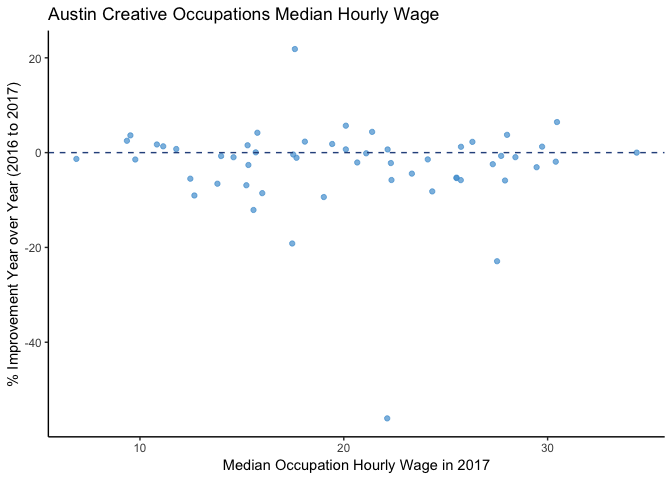

Install and Load Packages
-------------------------

``` r
##### Install and load packages
#install.packages("plotly")
#install.packages("tidyverse")
#install.packages("htmlwidgets")
#install.packages("webshot")
#webshot::install_phantomjs()
library(plotly)
```

    ## Loading required package: ggplot2

    ## 
    ## Attaching package: 'plotly'

    ## The following object is masked from 'package:ggplot2':
    ## 
    ##     last_plot

    ## The following object is masked from 'package:stats':
    ## 
    ##     filter

    ## The following object is masked from 'package:graphics':
    ## 
    ##     layout

``` r
library(tidyverse)
```

    ## ── Attaching packages ────────────────────────────────────────────────── tidyverse 1.2.1 ──

    ## ✔ tibble  2.0.1     ✔ purrr   0.3.0
    ## ✔ tidyr   0.8.2     ✔ dplyr   0.7.8
    ## ✔ readr   1.2.1     ✔ stringr 1.4.0
    ## ✔ tibble  2.0.1     ✔ forcats 0.3.0

    ## ── Conflicts ───────────────────────────────────────────────────── tidyverse_conflicts() ──
    ## ✖ dplyr::filter() masks plotly::filter(), stats::filter()
    ## ✖ dplyr::lag()    masks stats::lag()

``` r
library(htmlwidgets)
```

Downloading Data
----------------

``` r
##### Import data

creatives <- read.csv(file="https://raw.githubusercontent.com/lgellis/MiscTutorial/master/ggplotly/Median_Earnings_of_Creative_Sector_Occupations__CLL.B.1.csv",
                      header=TRUE, sep=",", stringsAsFactors = FALSE)

dim(creatives)
```

    ## [1] 54  4

``` r
summary(creatives)
```

    ##    SOC.Code          Occupation        X2016.Median.hourly.earnings
    ##  Length:54          Length:54          Min.   : 6.79               
    ##  Class :character   Class :character   1st Qu.:14.29               
    ##  Mode  :character   Mode  :character   Median :20.24               
    ##                                        Mean   :19.68               
    ##                                        3rd Qu.:24.25               
    ##                                        Max.   :34.37               
    ##  X2017.Median.hourly.earnings
    ##  Min.   : 6.88               
    ##  1st Qu.:15.29               
    ##  Median :20.10               
    ##  Mean   :20.12               
    ##  3rd Qu.:25.69               
    ##  Max.   :34.37

``` r
str(creatives)
```

    ## 'data.frame':    54 obs. of  4 variables:
    ##  $ SOC.Code                    : chr  "11-2011" "13-1011" "25-1099" "25-4011" ...
    ##  $ Occupation                  : chr  "Advertising and promotions managers" "Agents and business managers of artists, performers, and athletes" "Postsecondary teachers" "Archivists" ...
    ##  $ X2016.Median.hourly.earnings: num  30.1 21.8 26.9 26.7 32.6 ...
    ##  $ X2017.Median.hourly.earnings: num  29.7 22.3 26.3 27.3 30.5 ...

``` r
head(creatives)
```

    ##   SOC.Code
    ## 1  11-2011
    ## 2  13-1011
    ## 3  25-1099
    ## 4  25-4011
    ## 5  25-4012
    ## 6  25-4013
    ##                                                          Occupation
    ## 1                               Advertising and promotions managers
    ## 2 Agents and business managers of artists, performers, and athletes
    ## 3                                            Postsecondary teachers
    ## 4                                                        Archivists
    ## 5                                                          Curators
    ## 6                               Museum technicians and conservators
    ##   X2016.Median.hourly.earnings X2017.Median.hourly.earnings
    ## 1                        30.11                        29.73
    ## 2                        21.83                        22.31
    ## 3                        26.92                        26.31
    ## 4                        26.66                        27.31
    ## 5                        32.56                        30.46
    ## 6                        24.33                        25.74

Format Data and create interactive scatterplot
----------------------------------------------

``` r
##### Data processing
#Rename the columns and create a new column for year over year change

creatives <- creatives %>% 
  rename(Median_2016 = X2016.Median.hourly.earnings, Median_2017 = X2017.Median.hourly.earnings) %>% 
  rowwise() %>% 
  mutate(Percent_Improvement = round((Median_2016-Median_2017)/Median_2016*100,2))


##### Create a scatterPlot

scatterPlot <- creatives %>% 
  ggplot(aes(x = Median_2017, y = Percent_Improvement)) + 
  geom_point(alpha=0.7, colour = "#51A0D5") + 
  labs(x = "Median Occupation Hourly Wage in 2017", 
       y = "% Improvement Year over Year (2016 to 2017)",
       title = "Austin Creative Occupations Median Hourly Wage") +
  geom_hline(yintercept=0, linetype="dashed", color = "#2C528C", size=0.5) +
  theme_classic()

ggplotly(scatterPlot)
```


