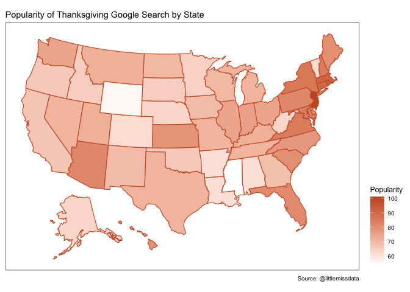
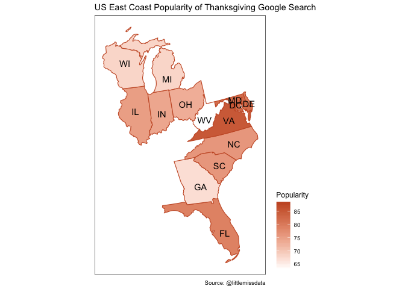

------------------------------------------------------------------------

title: “usmap” author: “Laura Ellis” date: “11/27/2019” output:
md\_document: variant: markdown\_github —

Tutorial
--------

The full tutorial and description is available at
[littlemissdata.com](https://www.littlemissdata.com/blog)

Install and Load Packages
-------------------------

Check for packages installed, install if needed and load package. I
found this code off of [Vikram Baliga’s
blog](https://www.vikram-baliga.com/blog/2015/7/19/a-hassle-free-way-to-verify-that-r-packages-are-installed-and-loaded)

``` r
#specify the packages of interest
packages = c("gtrendsR","tidyverse","usmap")

#use this function to check if each package is on the local machine
#if a package is installed, it will be loaded
#if any are not, the missing package(s) will be installed and loaded
package.check <- lapply(packages, FUN = function(x) {
    if (!require(x, character.only = TRUE)) {
        install.packages(x, dependencies = TRUE)
        library(x, character.only = TRUE)
    }
})
```

    ## Loading required package: gtrendsR

    ## Loading required package: tidyverse

    ## ── Attaching packages ─────────────────────────────────────────────────────────────────────────────────────── tidyverse 1.2.1 ──

    ## ✔ ggplot2 3.2.0     ✔ purrr   0.3.2
    ## ✔ tibble  2.1.3     ✔ dplyr   0.8.3
    ## ✔ tidyr   0.8.3     ✔ stringr 1.4.0
    ## ✔ readr   1.3.1     ✔ forcats 0.4.0

    ## ── Conflicts ────────────────────────────────────────────────────────────────────────────────────────── tidyverse_conflicts() ──
    ## ✖ dplyr::filter() masks stats::filter()
    ## ✖ dplyr::lag()    masks stats::lag()

    ## Loading required package: usmap

``` r
#verify they are loaded
search()
```

    ##  [1] ".GlobalEnv"        "package:usmap"     "package:forcats"  
    ##  [4] "package:stringr"   "package:dplyr"     "package:purrr"    
    ##  [7] "package:readr"     "package:tidyr"     "package:tibble"   
    ## [10] "package:ggplot2"   "package:tidyverse" "package:gtrendsR" 
    ## [13] "package:stats"     "package:graphics"  "package:grDevices"
    ## [16] "package:utils"     "package:datasets"  "package:methods"  
    ## [19] "Autoloads"         "package:base"

``` r
#Set some variables

orange <- "#C9592E"
```

Get thanksgiving trends
-----------------------

Use the [gTrendsR
Package](https://cran.r-project.org/web/packages/gtrendsR/gtrendsR.pdf)
to get the query trends for thanksgiving in the US for the past 24 hours

``` r
thanksgiving <- gtrends("thanksgiving",geo = "US", time = "now 1-d") # last day
```

Gather Interest by State
------------------------

Select the data frame for interest by state and then convert the names
of the states to FIPS codes (2 characters for state, 5 characters for
county).

``` r
thanksgivingStates <- thanksgiving$interest_by_region

#The usmap requires the data in FIPS format.
# To gather the FIPS data, use the fips() function to convert state name to code
#https://www.rdocumentation.org/packages/cdlTools/versions/0.14/topics/fips

thanksgivingStates$fips <-fips(thanksgivingStates$location)
```

Plot interest with the US Map by state
--------------------------------------

Create a US heatmap with google search popularity for the keyword
“thanksgiving”.

``` r
plot_usmap(data = thanksgivingStates, values = "hits",  color = orange, labels=TRUE) + 
  scale_fill_continuous( low = "white", high = orange, 
                         name = "Popularity", label = scales::comma
  ) + 
  theme(legend.position = "right") + 
  theme(panel.background = element_rect(colour = "black")) + 
  labs(title = "Popularity of Thanksgiving Google Search by State", caption = "Source: @littlemissdata") 
```



Plot interest with the US Map by state
--------------------------------------

Drill in on the seemingly most popular regions using the “include”
parameter in the plot\_usmap() function. Regional divisions can be found
in the docs
[here](https://cran.r-project.org/web/packages/usmap/usmap.pdf)

``` r
plot_usmap(data = thanksgivingStates, values = "hits", include =  c(.south_atlantic, .east_north_central), color = orange, labels=TRUE) + 
  scale_fill_continuous( low = "white", high = orange, 
                         name = "Popularity", label = scales::comma
  ) + 
  theme(legend.position = "right") + 
  theme(panel.background = element_rect(colour = "black")) + 
  labs(title = "US East Coast Popularity of Thanksgiving Google Search", caption = "Source: @littlemissdata") 
```


