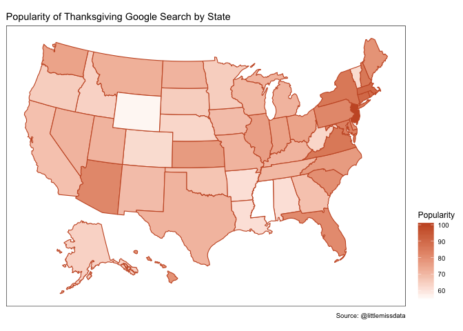
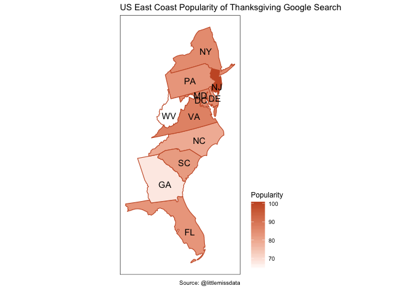

------------------------------------------------------------------------

title: “usmap” author: “Laura Ellis” date: “11/27/2019” output:
md\_document: variant: markdown\_github —

Tutorial
--------

The full tutorial and description is available at
[littlemissdata.com](https://www.littlemissdata.com/blog)

Install and Load Packages
-------------------------

Check for packages installed, install if needed and load package. I
found this code off of [Vikram Baliga’s
blog](https://www.vikram-baliga.com/blog/2015/7/19/a-hassle-free-way-to-verify-that-r-packages-are-installed-and-loaded)

``` r
#specify the packages of interest
packages = c("gtrendsR","tidyverse","usmap")

#use this function to check if each package is on the local machine
#if a package is installed, it will be loaded
#if any are not, the missing package(s) will be installed and loaded
package.check <- lapply(packages, FUN = function(x) {
    if (!require(x, character.only = TRUE)) {
        install.packages(x, dependencies = TRUE)
        library(x, character.only = TRUE)
    }
})
```

    ## Loading required package: gtrendsR

    ## Loading required package: tidyverse

    ## ── Attaching packages ─────────────────────────────────────────────────────────────── tidyverse 1.2.1 ──

    ## ✔ ggplot2 3.2.0     ✔ purrr   0.3.2
    ## ✔ tibble  2.1.3     ✔ dplyr   0.8.3
    ## ✔ tidyr   0.8.3     ✔ stringr 1.4.0
    ## ✔ readr   1.3.1     ✔ forcats 0.4.0

    ## ── Conflicts ────────────────────────────────────────────────────────────────── tidyverse_conflicts() ──
    ## ✖ dplyr::filter() masks stats::filter()
    ## ✖ dplyr::lag()    masks stats::lag()

    ## Loading required package: usmap

``` r
#verify they are loaded
search()
```

    ##  [1] ".GlobalEnv"        "package:usmap"     "package:forcats"  
    ##  [4] "package:stringr"   "package:dplyr"     "package:purrr"    
    ##  [7] "package:readr"     "package:tidyr"     "package:tibble"   
    ## [10] "package:ggplot2"   "package:tidyverse" "package:gtrendsR" 
    ## [13] "package:stats"     "package:graphics"  "package:grDevices"
    ## [16] "package:utils"     "package:datasets"  "package:methods"  
    ## [19] "Autoloads"         "package:base"

``` r
#Set some variables

orange <- "#C9592E"
```

Get thanksgiving trends
-----------------------

Use the [gTrendsR
Package](https://cran.r-project.org/web/packages/gtrendsR/gtrendsR.pdf)
to get the query trends for thanksgiving in the US for the past 24 hours

``` r
thanksgiving <- gtrends("thanksgiving",geo = "US", time = "now 1-d") # last day
head(thanksgiving)
```

    ## $interest_over_time
    ##                    date hits geo    time      keyword gprop category
    ## 1   2019-11-26 16:24:00   62  US now 1-d thanksgiving   web        0
    ## 2   2019-11-26 16:32:00   61  US now 1-d thanksgiving   web        0
    ## 3   2019-11-26 16:40:00   60  US now 1-d thanksgiving   web        0
    ## 4   2019-11-26 16:48:00   59  US now 1-d thanksgiving   web        0
    ## 5   2019-11-26 16:56:00   61  US now 1-d thanksgiving   web        0
    ## 6   2019-11-26 17:04:00   60  US now 1-d thanksgiving   web        0
    ## 7   2019-11-26 17:12:00   59  US now 1-d thanksgiving   web        0
    ## 8   2019-11-26 17:20:00   60  US now 1-d thanksgiving   web        0
    ## 9   2019-11-26 17:28:00   61  US now 1-d thanksgiving   web        0
    ## 10  2019-11-26 17:36:00   59  US now 1-d thanksgiving   web        0
    ## 11  2019-11-26 17:44:00   58  US now 1-d thanksgiving   web        0
    ## 12  2019-11-26 17:52:00   57  US now 1-d thanksgiving   web        0
    ## 13  2019-11-26 18:00:00   58  US now 1-d thanksgiving   web        0
    ## 14  2019-11-26 18:08:00   56  US now 1-d thanksgiving   web        0
    ## 15  2019-11-26 18:16:00   58  US now 1-d thanksgiving   web        0
    ## 16  2019-11-26 18:24:00   58  US now 1-d thanksgiving   web        0
    ## 17  2019-11-26 18:32:00   56  US now 1-d thanksgiving   web        0
    ## 18  2019-11-26 18:40:00   56  US now 1-d thanksgiving   web        0
    ## 19  2019-11-26 18:48:00   57  US now 1-d thanksgiving   web        0
    ## 20  2019-11-26 18:56:00   54  US now 1-d thanksgiving   web        0
    ## 21  2019-11-26 19:04:00   57  US now 1-d thanksgiving   web        0
    ## 22  2019-11-26 19:12:00   56  US now 1-d thanksgiving   web        0
    ## 23  2019-11-26 19:20:00   54  US now 1-d thanksgiving   web        0
    ## 24  2019-11-26 19:28:00   56  US now 1-d thanksgiving   web        0
    ## 25  2019-11-26 19:36:00   56  US now 1-d thanksgiving   web        0
    ## 26  2019-11-26 19:44:00   54  US now 1-d thanksgiving   web        0
    ## 27  2019-11-26 19:52:00   55  US now 1-d thanksgiving   web        0
    ## 28  2019-11-26 20:00:00   52  US now 1-d thanksgiving   web        0
    ## 29  2019-11-26 20:08:00   54  US now 1-d thanksgiving   web        0
    ## 30  2019-11-26 20:16:00   51  US now 1-d thanksgiving   web        0
    ## 31  2019-11-26 20:24:00   53  US now 1-d thanksgiving   web        0
    ## 32  2019-11-26 20:32:00   53  US now 1-d thanksgiving   web        0
    ## 33  2019-11-26 20:40:00   51  US now 1-d thanksgiving   web        0
    ## 34  2019-11-26 20:48:00   51  US now 1-d thanksgiving   web        0
    ## 35  2019-11-26 20:56:00   52  US now 1-d thanksgiving   web        0
    ## 36  2019-11-26 21:04:00   51  US now 1-d thanksgiving   web        0
    ## 37  2019-11-26 21:12:00   52  US now 1-d thanksgiving   web        0
    ## 38  2019-11-26 21:20:00   52  US now 1-d thanksgiving   web        0
    ## 39  2019-11-26 21:28:00   51  US now 1-d thanksgiving   web        0
    ## 40  2019-11-26 21:36:00   51  US now 1-d thanksgiving   web        0
    ## 41  2019-11-26 21:44:00   51  US now 1-d thanksgiving   web        0
    ## 42  2019-11-26 21:52:00   53  US now 1-d thanksgiving   web        0
    ## 43  2019-11-26 22:00:00   52  US now 1-d thanksgiving   web        0
    ## 44  2019-11-26 22:08:00   54  US now 1-d thanksgiving   web        0
    ## 45  2019-11-26 22:16:00   50  US now 1-d thanksgiving   web        0
    ## 46  2019-11-26 22:24:00   52  US now 1-d thanksgiving   web        0
    ## 47  2019-11-26 22:32:00   53  US now 1-d thanksgiving   web        0
    ## 48  2019-11-26 22:40:00   53  US now 1-d thanksgiving   web        0
    ## 49  2019-11-26 22:48:00   55  US now 1-d thanksgiving   web        0
    ## 50  2019-11-26 22:56:00   54  US now 1-d thanksgiving   web        0
    ## 51  2019-11-26 23:04:00   53  US now 1-d thanksgiving   web        0
    ## 52  2019-11-26 23:12:00   55  US now 1-d thanksgiving   web        0
    ## 53  2019-11-26 23:20:00   55  US now 1-d thanksgiving   web        0
    ## 54  2019-11-26 23:28:00   54  US now 1-d thanksgiving   web        0
    ## 55  2019-11-26 23:36:00   54  US now 1-d thanksgiving   web        0
    ## 56  2019-11-26 23:44:00   53  US now 1-d thanksgiving   web        0
    ## 57  2019-11-26 23:52:00   55  US now 1-d thanksgiving   web        0
    ## 58  2019-11-27 00:00:00   53  US now 1-d thanksgiving   web        0
    ## 59  2019-11-27 00:08:00   53  US now 1-d thanksgiving   web        0
    ## 60  2019-11-27 00:16:00   54  US now 1-d thanksgiving   web        0
    ## 61  2019-11-27 00:24:00   53  US now 1-d thanksgiving   web        0
    ## 62  2019-11-27 00:32:00   54  US now 1-d thanksgiving   web        0
    ## 63  2019-11-27 00:40:00   52  US now 1-d thanksgiving   web        0
    ## 64  2019-11-27 00:48:00   52  US now 1-d thanksgiving   web        0
    ## 65  2019-11-27 00:56:00   52  US now 1-d thanksgiving   web        0
    ## 66  2019-11-27 01:04:00   51  US now 1-d thanksgiving   web        0
    ## 67  2019-11-27 01:12:00   51  US now 1-d thanksgiving   web        0
    ## 68  2019-11-27 01:20:00   52  US now 1-d thanksgiving   web        0
    ## 69  2019-11-27 01:28:00   54  US now 1-d thanksgiving   web        0
    ## 70  2019-11-27 01:36:00   51  US now 1-d thanksgiving   web        0
    ## 71  2019-11-27 01:44:00   50  US now 1-d thanksgiving   web        0
    ## 72  2019-11-27 01:52:00   51  US now 1-d thanksgiving   web        0
    ## 73  2019-11-27 02:00:00   49  US now 1-d thanksgiving   web        0
    ## 74  2019-11-27 02:08:00   47  US now 1-d thanksgiving   web        0
    ## 75  2019-11-27 02:16:00   49  US now 1-d thanksgiving   web        0
    ## 76  2019-11-27 02:24:00   49  US now 1-d thanksgiving   web        0
    ## 77  2019-11-27 02:32:00   50  US now 1-d thanksgiving   web        0
    ## 78  2019-11-27 02:40:00   50  US now 1-d thanksgiving   web        0
    ## 79  2019-11-27 02:48:00   49  US now 1-d thanksgiving   web        0
    ## 80  2019-11-27 02:56:00   47  US now 1-d thanksgiving   web        0
    ## 81  2019-11-27 03:04:00   46  US now 1-d thanksgiving   web        0
    ## 82  2019-11-27 03:12:00   47  US now 1-d thanksgiving   web        0
    ## 83  2019-11-27 03:20:00   46  US now 1-d thanksgiving   web        0
    ## 84  2019-11-27 03:28:00   47  US now 1-d thanksgiving   web        0
    ## 85  2019-11-27 03:36:00   46  US now 1-d thanksgiving   web        0
    ## 86  2019-11-27 03:44:00   46  US now 1-d thanksgiving   web        0
    ## 87  2019-11-27 03:52:00   45  US now 1-d thanksgiving   web        0
    ## 88  2019-11-27 04:00:00   44  US now 1-d thanksgiving   web        0
    ## 89  2019-11-27 04:08:00   45  US now 1-d thanksgiving   web        0
    ## 90  2019-11-27 04:16:00   45  US now 1-d thanksgiving   web        0
    ## 91  2019-11-27 04:24:00   44  US now 1-d thanksgiving   web        0
    ## 92  2019-11-27 04:32:00   44  US now 1-d thanksgiving   web        0
    ## 93  2019-11-27 04:40:00   42  US now 1-d thanksgiving   web        0
    ## 94  2019-11-27 04:48:00   43  US now 1-d thanksgiving   web        0
    ## 95  2019-11-27 04:56:00   43  US now 1-d thanksgiving   web        0
    ## 96  2019-11-27 05:04:00   42  US now 1-d thanksgiving   web        0
    ## 97  2019-11-27 05:12:00   39  US now 1-d thanksgiving   web        0
    ## 98  2019-11-27 05:20:00   40  US now 1-d thanksgiving   web        0
    ## 99  2019-11-27 05:28:00   40  US now 1-d thanksgiving   web        0
    ## 100 2019-11-27 05:36:00   36  US now 1-d thanksgiving   web        0
    ## 101 2019-11-27 05:44:00   35  US now 1-d thanksgiving   web        0
    ## 102 2019-11-27 05:52:00   36  US now 1-d thanksgiving   web        0
    ## 103 2019-11-27 06:00:00   36  US now 1-d thanksgiving   web        0
    ## 104 2019-11-27 06:08:00   36  US now 1-d thanksgiving   web        0
    ## 105 2019-11-27 06:16:00   34  US now 1-d thanksgiving   web        0
    ## 106 2019-11-27 06:24:00   36  US now 1-d thanksgiving   web        0
    ## 107 2019-11-27 06:32:00   36  US now 1-d thanksgiving   web        0
    ## 108 2019-11-27 06:40:00   34  US now 1-d thanksgiving   web        0
    ## 109 2019-11-27 06:48:00   36  US now 1-d thanksgiving   web        0
    ## 110 2019-11-27 06:56:00   34  US now 1-d thanksgiving   web        0
    ## 111 2019-11-27 07:04:00   36  US now 1-d thanksgiving   web        0
    ## 112 2019-11-27 07:12:00   35  US now 1-d thanksgiving   web        0
    ## 113 2019-11-27 07:20:00   37  US now 1-d thanksgiving   web        0
    ## 114 2019-11-27 07:28:00   35  US now 1-d thanksgiving   web        0
    ## 115 2019-11-27 07:36:00   35  US now 1-d thanksgiving   web        0
    ## 116 2019-11-27 07:44:00   35  US now 1-d thanksgiving   web        0
    ## 117 2019-11-27 07:52:00   34  US now 1-d thanksgiving   web        0
    ## 118 2019-11-27 08:00:00   35  US now 1-d thanksgiving   web        0
    ## 119 2019-11-27 08:08:00   36  US now 1-d thanksgiving   web        0
    ## 120 2019-11-27 08:16:00   35  US now 1-d thanksgiving   web        0
    ## 121 2019-11-27 08:24:00   35  US now 1-d thanksgiving   web        0
    ## 122 2019-11-27 08:32:00   32  US now 1-d thanksgiving   web        0
    ## 123 2019-11-27 08:40:00   35  US now 1-d thanksgiving   web        0
    ## 124 2019-11-27 08:48:00   36  US now 1-d thanksgiving   web        0
    ## 125 2019-11-27 08:56:00   34  US now 1-d thanksgiving   web        0
    ## 126 2019-11-27 09:04:00   35  US now 1-d thanksgiving   web        0
    ## 127 2019-11-27 09:12:00   35  US now 1-d thanksgiving   web        0
    ## 128 2019-11-27 09:20:00   37  US now 1-d thanksgiving   web        0
    ## 129 2019-11-27 09:28:00   37  US now 1-d thanksgiving   web        0
    ## 130 2019-11-27 09:36:00   37  US now 1-d thanksgiving   web        0
    ## 131 2019-11-27 09:44:00   36  US now 1-d thanksgiving   web        0
    ## 132 2019-11-27 09:52:00   42  US now 1-d thanksgiving   web        0
    ## 133 2019-11-27 10:00:00   43  US now 1-d thanksgiving   web        0
    ## 134 2019-11-27 10:08:00   45  US now 1-d thanksgiving   web        0
    ## 135 2019-11-27 10:16:00   46  US now 1-d thanksgiving   web        0
    ## 136 2019-11-27 10:24:00   47  US now 1-d thanksgiving   web        0
    ## 137 2019-11-27 10:32:00   48  US now 1-d thanksgiving   web        0
    ## 138 2019-11-27 10:40:00   50  US now 1-d thanksgiving   web        0
    ## 139 2019-11-27 10:48:00   53  US now 1-d thanksgiving   web        0
    ## 140 2019-11-27 10:56:00   54  US now 1-d thanksgiving   web        0
    ## 141 2019-11-27 11:04:00   55  US now 1-d thanksgiving   web        0
    ## 142 2019-11-27 11:12:00   57  US now 1-d thanksgiving   web        0
    ## 143 2019-11-27 11:20:00   57  US now 1-d thanksgiving   web        0
    ## 144 2019-11-27 11:28:00   58  US now 1-d thanksgiving   web        0
    ## 145 2019-11-27 11:36:00   61  US now 1-d thanksgiving   web        0
    ## 146 2019-11-27 11:44:00   65  US now 1-d thanksgiving   web        0
    ## 147 2019-11-27 11:52:00   73  US now 1-d thanksgiving   web        0
    ## 148 2019-11-27 12:00:00   76  US now 1-d thanksgiving   web        0
    ## 149 2019-11-27 12:08:00   77  US now 1-d thanksgiving   web        0
    ## 150 2019-11-27 12:16:00   79  US now 1-d thanksgiving   web        0
    ## 151 2019-11-27 12:24:00   80  US now 1-d thanksgiving   web        0
    ## 152 2019-11-27 12:32:00   85  US now 1-d thanksgiving   web        0
    ## 153 2019-11-27 12:40:00   87  US now 1-d thanksgiving   web        0
    ## 154 2019-11-27 12:48:00   91  US now 1-d thanksgiving   web        0
    ## 155 2019-11-27 12:56:00   91  US now 1-d thanksgiving   web        0
    ## 156 2019-11-27 13:04:00   96  US now 1-d thanksgiving   web        0
    ## 157 2019-11-27 13:12:00   96  US now 1-d thanksgiving   web        0
    ## 158 2019-11-27 13:20:00   98  US now 1-d thanksgiving   web        0
    ## 159 2019-11-27 13:28:00   96  US now 1-d thanksgiving   web        0
    ## 160 2019-11-27 13:36:00   96  US now 1-d thanksgiving   web        0
    ## 161 2019-11-27 13:44:00   97  US now 1-d thanksgiving   web        0
    ## 162 2019-11-27 13:52:00   96  US now 1-d thanksgiving   web        0
    ## 163 2019-11-27 14:00:00   95  US now 1-d thanksgiving   web        0
    ## 164 2019-11-27 14:08:00   97  US now 1-d thanksgiving   web        0
    ## 165 2019-11-27 14:16:00   96  US now 1-d thanksgiving   web        0
    ## 166 2019-11-27 14:24:00  100  US now 1-d thanksgiving   web        0
    ## 167 2019-11-27 14:32:00   95  US now 1-d thanksgiving   web        0
    ## 168 2019-11-27 14:40:00   97  US now 1-d thanksgiving   web        0
    ## 169 2019-11-27 14:48:00   93  US now 1-d thanksgiving   web        0
    ## 170 2019-11-27 14:56:00   95  US now 1-d thanksgiving   web        0
    ## 171 2019-11-27 15:04:00   95  US now 1-d thanksgiving   web        0
    ## 172 2019-11-27 15:12:00   92  US now 1-d thanksgiving   web        0
    ## 173 2019-11-27 15:20:00   94  US now 1-d thanksgiving   web        0
    ## 174 2019-11-27 15:28:00   93  US now 1-d thanksgiving   web        0
    ## 175 2019-11-27 15:36:00   95  US now 1-d thanksgiving   web        0
    ## 176 2019-11-27 15:44:00   95  US now 1-d thanksgiving   web        0
    ## 177 2019-11-27 15:52:00   96  US now 1-d thanksgiving   web        0
    ## 178 2019-11-27 16:00:00   95  US now 1-d thanksgiving   web        0
    ## 179 2019-11-27 16:08:00   93  US now 1-d thanksgiving   web        0
    ## 180 2019-11-27 16:16:00   86  US now 1-d thanksgiving   web        0
    ## 
    ## $interest_by_country
    ## NULL
    ## 
    ## $interest_by_region
    ##                location hits      keyword geo gprop
    ## 1            New Jersey  100 thanksgiving  US   web
    ## 2         Massachusetts   90 thanksgiving  US   web
    ## 3          Rhode Island   89 thanksgiving  US   web
    ## 4           Connecticut   89 thanksgiving  US   web
    ## 5              Virginia   86 thanksgiving  US   web
    ## 6  District of Columbia   86 thanksgiving  US   web
    ## 7              New York   86 thanksgiving  US   web
    ## 8              Maryland   85 thanksgiving  US   web
    ## 9         New Hampshire   85 thanksgiving  US   web
    ## 10              Arizona   82 thanksgiving  US   web
    ## 11         Pennsylvania   82 thanksgiving  US   web
    ## 12              Florida   82 thanksgiving  US   web
    ## 13       South Carolina   80 thanksgiving  US   web
    ## 14             Delaware   80 thanksgiving  US   web
    ## 15                Maine   79 thanksgiving  US   web
    ## 16               Hawaii   79 thanksgiving  US   web
    ## 17       North Carolina   77 thanksgiving  US   web
    ## 18               Kansas   77 thanksgiving  US   web
    ## 19             Illinois   76 thanksgiving  US   web
    ## 20              Indiana   76 thanksgiving  US   web
    ## 21                 Ohio   75 thanksgiving  US   web
    ## 22           Washington   75 thanksgiving  US   web
    ## 23              Montana   73 thanksgiving  US   web
    ## 24             Missouri   72 thanksgiving  US   web
    ## 25             Kentucky   72 thanksgiving  US   web
    ## 26            Tennessee   72 thanksgiving  US   web
    ## 27            Wisconsin   71 thanksgiving  US   web
    ## 28             Michigan   71 thanksgiving  US   web
    ## 29                 Utah   71 thanksgiving  US   web
    ## 30                Texas   71 thanksgiving  US   web
    ## 31               Nevada   70 thanksgiving  US   web
    ## 32                 Iowa   70 thanksgiving  US   web
    ## 33           New Mexico   69 thanksgiving  US   web
    ## 34         North Dakota   69 thanksgiving  US   web
    ## 35              Georgia   68 thanksgiving  US   web
    ## 36           California   68 thanksgiving  US   web
    ## 37             Oklahoma   66 thanksgiving  US   web
    ## 38            Minnesota   66 thanksgiving  US   web
    ## 39               Oregon   65 thanksgiving  US   web
    ## 40                Idaho   64 thanksgiving  US   web
    ## 41         South Dakota   64 thanksgiving  US   web
    ## 42        West Virginia   63 thanksgiving  US   web
    ## 43              Vermont   63 thanksgiving  US   web
    ## 44               Alaska   63 thanksgiving  US   web
    ## 45             Nebraska   63 thanksgiving  US   web
    ## 46              Alabama   62 thanksgiving  US   web
    ## 47             Arkansas   61 thanksgiving  US   web
    ## 48             Colorado   61 thanksgiving  US   web
    ## 49            Louisiana   61 thanksgiving  US   web
    ## 50              Wyoming   56 thanksgiving  US   web
    ## 51          Mississippi   54 thanksgiving  US   web
    ## 
    ## $interest_by_dma
    ##                                                    location hits
    ## 1                              Providence RI-New Bedford MA  100
    ## 2                                   Hartford & New Haven CT   99
    ## 3                                   Boston MA-Manchester NH   98
    ## 4                                               New York NY   96
    ## 5                             Washington DC (Hagerstown MD)   95
    ## 6                                           Philadelphia PA   93
    ## 7                             West Palm Beach-Ft. Pierce FL   93
    ## 8                                       Ft. Myers-Naples FL   91
    ## 9                                              Baltimore MD   91
    ## 10                                  Miami-Ft. Lauderdale FL   90
    ## 11                                               Phoenix AZ   89
    ## 12                               Albany-Schenectady-Troy NY   89
    ## 13                       Tampa-St. Petersburg (Sarasota) FL   89
    ## 14                       Norfolk-Portsmouth-Newport News VA   89
    ## 15                                             Charlotte NC   87
    ## 16                                       Portland-Auburn ME   86
    ## 17                                              Columbus OH   86
    ## 18                                            Pittsburgh PA   86
    ## 19                                 Florence-Myrtle Beach SC   86
    ## 20                                              Honolulu HI   86
    ## 21                                                Austin TX   85
    ## 22                                   Richmond-Petersburg VA   85
    ## 23                                              Glendive MT   85
    ## 24       Greenville-Spartanburg SC-Asheville NC-Anderson SC   85
    ## 25                                            Charleston SC   85
    ## 26                                               Buffalo NY   85
    ## 27                                            Cincinnati OH   85
    ## 28                                             Rochester NY   84
    ## 29                                          Jacksonville FL   84
    ## 30                                               Chicago IL   83
    ## 31                                             Lafayette IN   83
    ## 32                         Raleigh-Durham (Fayetteville) NC   83
    ## 33                       Orlando-Daytona Beach-Melbourne FL   83
    ## 34                                             Knoxville TN   83
    ## 35                                 Wilkes Barre-Scranton PA   82
    ## 36                     Harrisburg-Lancaster-Lebanon-York PA   81
    ## 37                                           Kansas City MO   81
    ## 38                                 Tucson (Sierra Vista) AZ   81
    ## 39                                               Houston TX   81
    ## 40                                     Roanoke-Lynchburg VA   81
    ## 41                                              Syracuse NY   80
    ## 42                                        Seattle-Tacoma WA   80
    ## 43                                          Indianapolis IN   80
    ## 44                                       Charlottesville VA   80
    ## 45                                             San Diego CA   79
    ## 46                                              Missoula MT   79
    ## 47                                             Milwaukee WI   79
    ## 48                                    Green Bay-Appleton WI   79
    ## 49                                             Nashville TN   78
    ## 50                                               Detroit MI   78
    ## 51                                   Springfield-Holyoke MA   78
    ## 52                                            Binghamton NY   78
    ## 53                              Cleveland-Akron (Canton) OH   78
    ## 54                                               Madison WI   78
    ## 55                                           Great Falls MT   77
    ## 56                                            Louisville KY   77
    ## 57                                    South Bend-Elkhart IN   77
    ## 58                                            Wilmington NC   77
    ## 59                                            St. Joseph MO   77
    ## 60                                        Salt Lake City UT   77
    ## 61                                             Lexington KY   77
    ## 62                                      Dallas-Ft. Worth TX   76
    ## 63                                           Los Angeles CA   76
    ## 64                                          Harrisonburg VA   76
    ## 65                                             St. Louis MO   76
    ## 66                                                Bangor ME   76
    ## 67                                             Billings, MT   75
    ## 68                                       Des Moines-Ames IA   75
    ## 69                                                Juneau AK   75
    ## 70                                                Topeka KS   75
    ## 71                                             Las Vegas NV   75
    ## 72                                               Atlanta GA   75
    ## 73                                             Salisbury MD   75
    ## 74                                            Rapid City SD   75
    ## 75                   Grand Rapids-Kalamazoo-Battle Creek MI   75
    ## 76                                  Albuquerque-Santa Fe NM   74
    ## 77                                              Portland OR   74
    ## 78                                                Elmira NY   74
    ## 79                                                 Omaha NE   74
    ## 80                                    Wichita-Hutchinson KS   74
    ## 81                                              Columbia SC   73
    ## 82                                           Chattanooga TN   73
    ## 83                Mobile AL-Pensacola (Ft. Walton Beach) FL   73
    ## 84                                           Springfield MO   73
    ## 85                   Greensboro-High Point-Winston Salem NC   73
    ## 86                           Sacramento-Stockton-Modesto CA   72
    ## 87                                Flint-Saginaw-Bay City MI   72
    ## 88                        San Francisco-Oakland-San Jose CA   72
    ## 89                                                 Utica NY   72
    ## 90                                           San Antonio TX   72
    ## 91                                         Butte-Bozeman MT   72
    ## 92                                              Savannah GA   72
    ## 93                                         Oklahoma City OK   72
    ## 94                                             Anchorage AK   71
    ## 95                                               Spokane WA   71
    ## 96                                            Zanesville OH   71
    ## 97                                                  Erie PA   71
    ## 98             Cedar Rapids-Waterloo-Iowa City & Dubuque IA   71
    ## 99                   Minot-Bismarck-Dickinson(Williston) ND   71
    ## 100                                               Toledo OH   71
    ## 101                                               Alpena MI   71
    ## 102                                               Helena MT   70
    ## 103                            Burlington VT-Plattsburgh NY   70
    ## 104                                               Dayton OH   70
    ## 105                                    Fargo-Valley City ND   69
    ## 106                              Columbia-Jefferson City MO   69
    ## 107                                          New Orleans LA   69
    ## 108                                                Tulsa OK   69
    ## 109                                       Corpus Christi TX   69
    ## 110                                        Bowling Green KY   69
    ## 111                                             Rockford IL   69
    ## 112                                          Panama City FL   68
    ## 113                                  Joplin MO-Pittsburg KS   68
    ## 114                                 Minneapolis-St. Paul MN   68
    ## 115                                    Waco-Temple-Bryan TX   68
    ## 116                      Champaign & Springfield-Decatur IL   68
    ## 117                             Wheeling WV-Steubenville OH   67
    ## 118                               Traverse City-Cadillac MI   67
    ## 119                                         Palm Springs CA   67
    ## 120                                   Peoria-Bloomington IL   67
    ## 121                                           Birmingham AL   66
    ## 122                              Colorado Springs-Pueblo CO   66
    ## 123                                    Johnstown-Altoona PA   66
    ## 124                                           San Angelo TX   66
    ## 125                                          Gainesville FL   66
    ## 126                       Greenville-New Bern-Washington NC   66
    ## 127                                             Victoria TX   66
    ## 128                                          Terre Haute IN   66
    ## 129                                            Watertown NY   66
    ## 130                                        Tri-Cities TN-VA   66
    ## 131                         Quincy IL-Hannibal MO-Keokuk IA   66
    ## 132                                         Presque Isle ME   65
    ## 133                                              El Paso TX   65
    ## 134                                               Denver CO   65
    ## 135                                             Amarillo TX   65
    ## 136                      Davenport IA-Rock Island-Moline IL   65
    ## 137                                              Lansing MI   65
    ## 138                                   Wausau-Rhinelander WI   64
    ## 139                                       Fresno-Visalia CA   64
    ## 140                                           Evansville IN   64
    ## 141                                            Ft. Wayne IN   64
    ## 142             Ft. Smith-Fayetteville-Springdale-Rogers AR   64
    ## 143                                Ottumwa IA-Kirksville MO   64
    ## 144                           Bluefield-Beckley-Oak Hill WV   64
    ## 145                                                 Reno NV   64
    ## 146                                      Casper-Riverton WY   63
    ## 147                            Wichita Falls TX & Lawton OK   63
    ## 148                                           Twin Falls ID   63
    ## 149                                              Lubbock TX   63
    ## 150                                Sioux Falls(Mitchell) SD   63
    ## 151                              Grand Junction-Montrose CO   63
    ## 152                                       Sherman TX-Ada OK   62
    ## 153                                   Abilene-Sweetwater TX   62
    ## 154                                            Marquette MI   62
    ## 155                                           Youngstown OH   62
    ## 156                                            Fairbanks AK   62
    ## 157                                Idaho Falls-Pocatello ID   61
    ## 158                               Little Rock-Pine Bluff AR   61
    ## 159                                                Boise ID   61
    ## 160                                              Memphis TN   61
    ## 161                    Rochester MN-Mason City IA-Austin MN   61
    ## 162                      Yakima-Pasco-Richland-Kennewick WA   61
    ## 163 Paducah KY-Cape Girardeau MO-Harrisburg-Mount Vernon IL   61
    ## 164                                             Columbus GA   60
    ## 165                           Tallahassee FL-Thomasville GA   60
    ## 166                                              Jackson TN   60
    ## 167                                   Duluth MN-Superior WI   60
    ## 168                        Huntsville-Decatur (Florence) AL   59
    ## 169                                      Biloxi-Gulfport MS   59
    ## 170                                    Yuma AZ-El Centro CA   59
    ## 171                                          Parkersburg WV   58
    ## 172                                                 Lima OH   58
    ## 173                                              Mankato MN   58
    ## 174                                     Monterey-Salinas CA   58
    ## 175                                       Odessa-Midland TX   57
    ## 176                                              Augusta GA   57
    ## 177                                                 Bend OR   56
    ## 178                                Charleston-Huntington WV   56
    ## 179                                         Lake Charles LA   56
    ## 180            Santa Barbara-Santa Maria-San Luis Obispo CA   55
    ## 181                                          Baton Rouge LA   55
    ## 182                           Columbus-Tupelo-West Point MS   55
    ## 183                 Tyler-Longview(Lufkin & Nacogdoches) TX   55
    ## 184                                 La Crosse-Eau Claire WI   54
    ## 185                                                Macon GA   54
    ## 186                                        Chico-Redding CA   54
    ## 187                                           Alexandria LA   54
    ## 188                                   Hattiesburg-Laurel MS   53
    ## 189                           Lincoln & Hastings-Kearney NE   53
    ## 190                                               Eugene OR   53
    ## 191                                          Bakersfield CA   53
    ## 192                                               Albany GA   53
    ## 193                                           Shreveport LA   53
    ## 194                                               Laredo TX   52
    ## 195                                            Lafayette LA   52
    ## 196                                   Montgomery (Selma) AL   52
    ## 197                                             Meridian MS   52
    ## 198                                  Monroe LA-El Dorado AR   52
    ## 199                                    Clarksburg-Weston WV   51
    ## 200                                               Dothan AL   51
    ## 201                Harlingen-Weslaco-Brownsville-McAllen TX   51
    ## 202                                               Eureka CA   51
    ## 203                                Medford-Klamath Falls OR   51
    ## 204                                 Beaumont-Port Arthur TX   50
    ## 205                              Cheyenne WY-Scottsbluff NE   50
    ## 206                                            Jonesboro AR   50
    ## 207                                           Sioux City IA   47
    ## 208                                              Jackson MS   46
    ## 209                                         North Platte NE   42
    ## 210                                 Greenwood-Greenville MS   41
    ##          keyword geo gprop
    ## 1   thanksgiving  US   web
    ## 2   thanksgiving  US   web
    ## 3   thanksgiving  US   web
    ## 4   thanksgiving  US   web
    ## 5   thanksgiving  US   web
    ## 6   thanksgiving  US   web
    ## 7   thanksgiving  US   web
    ## 8   thanksgiving  US   web
    ## 9   thanksgiving  US   web
    ## 10  thanksgiving  US   web
    ## 11  thanksgiving  US   web
    ## 12  thanksgiving  US   web
    ## 13  thanksgiving  US   web
    ## 14  thanksgiving  US   web
    ## 15  thanksgiving  US   web
    ## 16  thanksgiving  US   web
    ## 17  thanksgiving  US   web
    ## 18  thanksgiving  US   web
    ## 19  thanksgiving  US   web
    ## 20  thanksgiving  US   web
    ## 21  thanksgiving  US   web
    ## 22  thanksgiving  US   web
    ## 23  thanksgiving  US   web
    ## 24  thanksgiving  US   web
    ## 25  thanksgiving  US   web
    ## 26  thanksgiving  US   web
    ## 27  thanksgiving  US   web
    ## 28  thanksgiving  US   web
    ## 29  thanksgiving  US   web
    ## 30  thanksgiving  US   web
    ## 31  thanksgiving  US   web
    ## 32  thanksgiving  US   web
    ## 33  thanksgiving  US   web
    ## 34  thanksgiving  US   web
    ## 35  thanksgiving  US   web
    ## 36  thanksgiving  US   web
    ## 37  thanksgiving  US   web
    ## 38  thanksgiving  US   web
    ## 39  thanksgiving  US   web
    ## 40  thanksgiving  US   web
    ## 41  thanksgiving  US   web
    ## 42  thanksgiving  US   web
    ## 43  thanksgiving  US   web
    ## 44  thanksgiving  US   web
    ## 45  thanksgiving  US   web
    ## 46  thanksgiving  US   web
    ## 47  thanksgiving  US   web
    ## 48  thanksgiving  US   web
    ## 49  thanksgiving  US   web
    ## 50  thanksgiving  US   web
    ## 51  thanksgiving  US   web
    ## 52  thanksgiving  US   web
    ## 53  thanksgiving  US   web
    ## 54  thanksgiving  US   web
    ## 55  thanksgiving  US   web
    ## 56  thanksgiving  US   web
    ## 57  thanksgiving  US   web
    ## 58  thanksgiving  US   web
    ## 59  thanksgiving  US   web
    ## 60  thanksgiving  US   web
    ## 61  thanksgiving  US   web
    ## 62  thanksgiving  US   web
    ## 63  thanksgiving  US   web
    ## 64  thanksgiving  US   web
    ## 65  thanksgiving  US   web
    ## 66  thanksgiving  US   web
    ## 67  thanksgiving  US   web
    ## 68  thanksgiving  US   web
    ## 69  thanksgiving  US   web
    ## 70  thanksgiving  US   web
    ## 71  thanksgiving  US   web
    ## 72  thanksgiving  US   web
    ## 73  thanksgiving  US   web
    ## 74  thanksgiving  US   web
    ## 75  thanksgiving  US   web
    ## 76  thanksgiving  US   web
    ## 77  thanksgiving  US   web
    ## 78  thanksgiving  US   web
    ## 79  thanksgiving  US   web
    ## 80  thanksgiving  US   web
    ## 81  thanksgiving  US   web
    ## 82  thanksgiving  US   web
    ## 83  thanksgiving  US   web
    ## 84  thanksgiving  US   web
    ## 85  thanksgiving  US   web
    ## 86  thanksgiving  US   web
    ## 87  thanksgiving  US   web
    ## 88  thanksgiving  US   web
    ## 89  thanksgiving  US   web
    ## 90  thanksgiving  US   web
    ## 91  thanksgiving  US   web
    ## 92  thanksgiving  US   web
    ## 93  thanksgiving  US   web
    ## 94  thanksgiving  US   web
    ## 95  thanksgiving  US   web
    ## 96  thanksgiving  US   web
    ## 97  thanksgiving  US   web
    ## 98  thanksgiving  US   web
    ## 99  thanksgiving  US   web
    ## 100 thanksgiving  US   web
    ## 101 thanksgiving  US   web
    ## 102 thanksgiving  US   web
    ## 103 thanksgiving  US   web
    ## 104 thanksgiving  US   web
    ## 105 thanksgiving  US   web
    ## 106 thanksgiving  US   web
    ## 107 thanksgiving  US   web
    ## 108 thanksgiving  US   web
    ## 109 thanksgiving  US   web
    ## 110 thanksgiving  US   web
    ## 111 thanksgiving  US   web
    ## 112 thanksgiving  US   web
    ## 113 thanksgiving  US   web
    ## 114 thanksgiving  US   web
    ## 115 thanksgiving  US   web
    ## 116 thanksgiving  US   web
    ## 117 thanksgiving  US   web
    ## 118 thanksgiving  US   web
    ## 119 thanksgiving  US   web
    ## 120 thanksgiving  US   web
    ## 121 thanksgiving  US   web
    ## 122 thanksgiving  US   web
    ## 123 thanksgiving  US   web
    ## 124 thanksgiving  US   web
    ## 125 thanksgiving  US   web
    ## 126 thanksgiving  US   web
    ## 127 thanksgiving  US   web
    ## 128 thanksgiving  US   web
    ## 129 thanksgiving  US   web
    ## 130 thanksgiving  US   web
    ## 131 thanksgiving  US   web
    ## 132 thanksgiving  US   web
    ## 133 thanksgiving  US   web
    ## 134 thanksgiving  US   web
    ## 135 thanksgiving  US   web
    ## 136 thanksgiving  US   web
    ## 137 thanksgiving  US   web
    ## 138 thanksgiving  US   web
    ## 139 thanksgiving  US   web
    ## 140 thanksgiving  US   web
    ## 141 thanksgiving  US   web
    ## 142 thanksgiving  US   web
    ## 143 thanksgiving  US   web
    ## 144 thanksgiving  US   web
    ## 145 thanksgiving  US   web
    ## 146 thanksgiving  US   web
    ## 147 thanksgiving  US   web
    ## 148 thanksgiving  US   web
    ## 149 thanksgiving  US   web
    ## 150 thanksgiving  US   web
    ## 151 thanksgiving  US   web
    ## 152 thanksgiving  US   web
    ## 153 thanksgiving  US   web
    ## 154 thanksgiving  US   web
    ## 155 thanksgiving  US   web
    ## 156 thanksgiving  US   web
    ## 157 thanksgiving  US   web
    ## 158 thanksgiving  US   web
    ## 159 thanksgiving  US   web
    ## 160 thanksgiving  US   web
    ## 161 thanksgiving  US   web
    ## 162 thanksgiving  US   web
    ## 163 thanksgiving  US   web
    ## 164 thanksgiving  US   web
    ## 165 thanksgiving  US   web
    ## 166 thanksgiving  US   web
    ## 167 thanksgiving  US   web
    ## 168 thanksgiving  US   web
    ## 169 thanksgiving  US   web
    ## 170 thanksgiving  US   web
    ## 171 thanksgiving  US   web
    ## 172 thanksgiving  US   web
    ## 173 thanksgiving  US   web
    ## 174 thanksgiving  US   web
    ## 175 thanksgiving  US   web
    ## 176 thanksgiving  US   web
    ## 177 thanksgiving  US   web
    ## 178 thanksgiving  US   web
    ## 179 thanksgiving  US   web
    ## 180 thanksgiving  US   web
    ## 181 thanksgiving  US   web
    ## 182 thanksgiving  US   web
    ## 183 thanksgiving  US   web
    ## 184 thanksgiving  US   web
    ## 185 thanksgiving  US   web
    ## 186 thanksgiving  US   web
    ## 187 thanksgiving  US   web
    ## 188 thanksgiving  US   web
    ## 189 thanksgiving  US   web
    ## 190 thanksgiving  US   web
    ## 191 thanksgiving  US   web
    ## 192 thanksgiving  US   web
    ## 193 thanksgiving  US   web
    ## 194 thanksgiving  US   web
    ## 195 thanksgiving  US   web
    ## 196 thanksgiving  US   web
    ## 197 thanksgiving  US   web
    ## 198 thanksgiving  US   web
    ## 199 thanksgiving  US   web
    ## 200 thanksgiving  US   web
    ## 201 thanksgiving  US   web
    ## 202 thanksgiving  US   web
    ## 203 thanksgiving  US   web
    ## 204 thanksgiving  US   web
    ## 205 thanksgiving  US   web
    ## 206 thanksgiving  US   web
    ## 207 thanksgiving  US   web
    ## 208 thanksgiving  US   web
    ## 209 thanksgiving  US   web
    ## 210 thanksgiving  US   web
    ## 
    ## $interest_by_city
    ##                  location hits      keyword geo gprop
    ## 1                Hillburn   NA thanksgiving  US   web
    ## 2             South Miami   NA thanksgiving  US   web
    ## 3               Long Hill   NA thanksgiving  US   web
    ## 4              Knightdale   NA thanksgiving  US   web
    ## 5                Leesburg  100 thanksgiving  US   web
    ## 6                 Wantagh   NA thanksgiving  US   web
    ## 7                   Essex   NA thanksgiving  US   web
    ## 8                Westwood   NA thanksgiving  US   web
    ## 9         Monroe Township   NA thanksgiving  US   web
    ## 10               Melville   NA thanksgiving  US   web
    ## 11             Bloomfield   NA thanksgiving  US   web
    ## 12           Mount Laurel   NA thanksgiving  US   web
    ## 13               Johnston   NA thanksgiving  US   web
    ## 14      Marlboro Township   NA thanksgiving  US   web
    ## 15    North New Hyde Park   NA thanksgiving  US   web
    ## 16                 Weston   NA thanksgiving  US   web
    ## 17          Wall Township   NA thanksgiving  US   web
    ## 18       Berkeley Heights   NA thanksgiving  US   web
    ## 19     Middleburg Heights   NA thanksgiving  US   web
    ## 20             Livingston   NA thanksgiving  US   web
    ## 21                Holmdel   NA thanksgiving  US   web
    ## 22           Coral Gables   NA thanksgiving  US   web
    ## 23               Cheshire   NA thanksgiving  US   web
    ## 24                Jackson   NA thanksgiving  US   web
    ## 25             Massapequa   NA thanksgiving  US   web
    ## 26                Paramus   NA thanksgiving  US   web
    ## 27              Plainview   NA thanksgiving  US   web
    ## 28        Sparta Township   NA thanksgiving  US   web
    ## 29                Beverly   NA thanksgiving  US   web
    ## 30      Franklin Township   NA thanksgiving  US   web
    ## 31                 Howell   85 thanksgiving  US   web
    ## 32                Commack   NA thanksgiving  US   web
    ## 33                  Wayne   NA thanksgiving  US   web
    ## 34           Eden Prairie   NA thanksgiving  US   web
    ## 35          Mount Lebanon   NA thanksgiving  US   web
    ## 36      Hopewell Township   NA thanksgiving  US   web
    ## 37   Springfield Township   NA thanksgiving  US   web
    ## 38                 Edison   85 thanksgiving  US   web
    ## 39                Andover   NA thanksgiving  US   web
    ## 40                 Natick   NA thanksgiving  US   web
    ## 41             Merrifield   NA thanksgiving  US   web
    ## 42                 Warren   NA thanksgiving  US   web
    ## 43               Harrison   NA thanksgiving  US   web
    ## 44  West Windsor Township   NA thanksgiving  US   web
    ## 45              Lexington   NA thanksgiving  US   web
    ## 46    Old Bridge Township   NA thanksgiving  US   web
    ## 47          Mechanicsburg   NA thanksgiving  US   web
    ## 48               Freeport   NA thanksgiving  US   web
    ## 49              Levittown   NA thanksgiving  US   web
    ## 50             Middletown   NA thanksgiving  US   web
    ## 51               Plymouth   NA thanksgiving  US   web
    ## 52           Gaithersburg   NA thanksgiving  US   web
    ## 53                 Oakton   NA thanksgiving  US   web
    ## 54                Norwood   NA thanksgiving  US   web
    ## 55          Miami Springs   NA thanksgiving  US   web
    ## 56             Glen Ridge   NA thanksgiving  US   web
    ## 57      Lawrence Township   NA thanksgiving  US   web
    ## 58    Washington Township   NA thanksgiving  US   web
    ## 59              Hockinson   NA thanksgiving  US   web
    ## 60           Southborough   NA thanksgiving  US   web
    ## 61                Clayton   NA thanksgiving  US   web
    ## 62                Needham   NA thanksgiving  US   web
    ## 63            Cherry Hill   NA thanksgiving  US   web
    ## 64            West Orange   NA thanksgiving  US   web
    ## 65        East Providence   NA thanksgiving  US   web
    ## 66            Southington   NA thanksgiving  US   web
    ## 67                 McLean   NA thanksgiving  US   web
    ## 68           Pimmit Hills   NA thanksgiving  US   web
    ## 69              Levittown   NA thanksgiving  US   web
    ## 70                Devault   NA thanksgiving  US   web
    ## 71             Doylestown   NA thanksgiving  US   web
    ## 72              Princeton   NA thanksgiving  US   web
    ## 73            Glastonbury   NA thanksgiving  US   web
    ## 74               Surprise   NA thanksgiving  US   web
    ## 75            Mooresville   NA thanksgiving  US   web
    ## 76                 Reston   NA thanksgiving  US   web
    ## 77              Watertown   NA thanksgiving  US   web
    ## 78     Hilton Head Island   NA thanksgiving  US   web
    ## 79           Severna Park   NA thanksgiving  US   web
    ## 80           New Rochelle   NA thanksgiving  US   web
    ## 81              Fort Mill   NA thanksgiving  US   web
    ## 82     Manalapan Township   NA thanksgiving  US   web
    ## 83              Braintree   NA thanksgiving  US   web
    ## 84                Milford   NA thanksgiving  US   web
    ## 85                Bayonne   NA thanksgiving  US   web
    ## 86           Orchard Park   NA thanksgiving  US   web
    ## 87                 Hamden   NA thanksgiving  US   web
    ## 88               Vineland   NA thanksgiving  US   web
    ## 89           White Plains   NA thanksgiving  US   web
    ## 90     Montgomery Village   NA thanksgiving  US   web
    ## 91               Stamford   NA thanksgiving  US   web
    ## 92              West Bend   NA thanksgiving  US   web
    ## 93               Beaufort   NA thanksgiving  US   web
    ## 94          West Hartford   NA thanksgiving  US   web
    ## 95             Middletown   NA thanksgiving  US   web
    ## 96          Pompano Beach   NA thanksgiving  US   web
    ## 97           Myrtle Beach   NA thanksgiving  US   web
    ## 98                Hanover   NA thanksgiving  US   web
    ## 99                  Salem   NA thanksgiving  US   web
    ## 100            Cumberland   NA thanksgiving  US   web
    ## 101              Maitland   NA thanksgiving  US   web
    ## 102            Boca Raton   78 thanksgiving  US   web
    ## 103               Tamiami   NA thanksgiving  US   web
    ## 104           Bridgewater   78 thanksgiving  US   web
    ## 105              Aventura   NA thanksgiving  US   web
    ## 106        Virginia Beach   78 thanksgiving  US   web
    ## 107         Coral Springs   NA thanksgiving  US   web
    ## 108            Burlington   NA thanksgiving  US   web
    ## 109             Billerica   NA thanksgiving  US   web
    ## 110         Silver Spring   76 thanksgiving  US   web
    ## 111                 Mason   NA thanksgiving  US   web
    ## 112            Washington   76 thanksgiving  US   web
    ## 113               Kendall   NA thanksgiving  US   web
    ## 114       Carolina Forest   NA thanksgiving  US   web
    ## 115                  Golf   NA thanksgiving  US   web
    ## 116                Destin   NA thanksgiving  US   web
    ## 117             Attleboro   NA thanksgiving  US   web
    ## 118            Hackensack   NA thanksgiving  US   web
    ## 119               Norwalk   NA thanksgiving  US   web
    ## 120              Weymouth   NA thanksgiving  US   web
    ## 121       King of Prussia   NA thanksgiving  US   web
    ## 122           Sevierville   NA thanksgiving  US   web
    ## 123        North Bethesda   NA thanksgiving  US   web
    ## 124        Merritt Island   NA thanksgiving  US   web
    ## 125        East Brunswick   NA thanksgiving  US   web
    ## 126              Glenview   NA thanksgiving  US   web
    ## 127              Franklin   NA thanksgiving  US   web
    ## 128                Woburn   NA thanksgiving  US   web
    ## 129              Elkridge   NA thanksgiving  US   web
    ## 130            Alexandria   75 thanksgiving  US   web
    ## 131                 Davie   75 thanksgiving  US   web
    ## 132              Fort Lee   NA thanksgiving  US   web
    ## 133              Socastee   NA thanksgiving  US   web
    ## 134          Delray Beach   NA thanksgiving  US   web
    ## 135           Johns Creek   NA thanksgiving  US   web
    ## 136              New York   75 thanksgiving  US   web
    ## 137         Ellicott City   NA thanksgiving  US   web
    ## 138                Newton   NA thanksgiving  US   web
    ## 139                 Brick   NA thanksgiving  US   web
    ## 140                Boston   75 thanksgiving  US   web
    ## 141               Roswell   75 thanksgiving  US   web
    ## 142             Hollywood   75 thanksgiving  US   web
    ## 143 West University Place   NA thanksgiving  US   web
    ## 144             Montclair   NA thanksgiving  US   web
    ## 145             Weehawken   NA thanksgiving  US   web
    ## 146         Bel Air South   NA thanksgiving  US   web
    ## 147              Wildwood   NA thanksgiving  US   web
    ## 148               Batavia   NA thanksgiving  US   web
    ## 149         Scotch Plains   NA thanksgiving  US   web
    ## 150      Town 'n' Country   NA thanksgiving  US   web
    ## 151              Oak Park   NA thanksgiving  US   web
    ## 152           Glen Burnie   NA thanksgiving  US   web
    ## 153           Queen Creek   NA thanksgiving  US   web
    ## 154                 Largo   NA thanksgiving  US   web
    ## 155              Denville   NA thanksgiving  US   web
    ## 156           Kings Point   NA thanksgiving  US   web
    ## 157    Saint Clair Shores   NA thanksgiving  US   web
    ## 158                 Doral   74 thanksgiving  US   web
    ## 159       Fairfax Station   NA thanksgiving  US   web
    ## 160               Coppell   NA thanksgiving  US   web
    ## 161               Endwell   NA thanksgiving  US   web
    ## 162    Palm Beach Gardens   NA thanksgiving  US   web
    ## 163                  Apex   NA thanksgiving  US   web
    ## 164          West Babylon   NA thanksgiving  US   web
    ## 165             Royal Oak   NA thanksgiving  US   web
    ## 166            Fruit Cove   NA thanksgiving  US   web
    ## 167                Malden   NA thanksgiving  US   web
    ## 168               Waltham   NA thanksgiving  US   web
    ## 169            Somerville   NA thanksgiving  US   web
    ## 170             Chantilly   74 thanksgiving  US   web
    ## 171               Danbury   NA thanksgiving  US   web
    ## 172              Columbus   74 thanksgiving  US   web
    ## 173   Manchester Township   NA thanksgiving  US   web
    ## 174              Keystone   NA thanksgiving  US   web
    ## 175                Quincy   NA thanksgiving  US   web
    ## 176               Dunedin   NA thanksgiving  US   web
    ## 177               Hoboken   NA thanksgiving  US   web
    ## 178             Charlotte   73 thanksgiving  US   web
    ## 179                Dublin   NA thanksgiving  US   web
    ## 180                 Burke   NA thanksgiving  US   web
    ## 181                  Lehi   NA thanksgiving  US   web
    ## 182             Asheville   73 thanksgiving  US   web
    ## 183                 Wayne   NA thanksgiving  US   web
    ## 184              Farragut   NA thanksgiving  US   web
    ## 185             Lake Mary   NA thanksgiving  US   web
    ## 186             Greenwich   NA thanksgiving  US   web
    ## 187             Annandale   NA thanksgiving  US   web
    ## 188               Gilbert   73 thanksgiving  US   web
    ## 189            Aspen Hill   NA thanksgiving  US   web
    ## 190          College Park   NA thanksgiving  US   web
    ## 191               Phoenix   73 thanksgiving  US   web
    ## 192         Newport Beach   73 thanksgiving  US   web
    ## 193                Albany   73 thanksgiving  US   web
    ## 194                Verona   73 thanksgiving  US   web
    ## 195               Warwick   NA thanksgiving  US   web
    ## 196           Irondequoit   NA thanksgiving  US   web
    ## 197               Fairfax   NA thanksgiving  US   web
    ## 198            Framingham   NA thanksgiving  US   web
    ## 199              Bee Cave   NA thanksgiving  US   web
    ## 200        West Lafayette   NA thanksgiving  US   web
    ## 
    ## $related_topics
    ##    subject related_topics                          value geo      keyword
    ## 1      100            top                   Thanksgiving  US thanksgiving
    ## 2       14            top                   Thanksgiving  US thanksgiving
    ## 3       10            top            Thanksgiving dinner  US thanksgiving
    ## 4        7            top                      Happiness  US thanksgiving
    ## 5        7            top                         Dinner  US thanksgiving
    ## 6        4            top Macy's Thanksgiving Day Parade  US thanksgiving
    ## 7        3            top                      Side dish  US thanksgiving
    ## 8        3            top                           Dish  US thanksgiving
    ## 9        3            top                        Dessert  US thanksgiving
    ## 10       2            top   A Charlie Brown Thanksgiving  US thanksgiving
    ## 11       2            top                         Parade  US thanksgiving
    ## 12       2            top                  Hors d'oeuvre  US thanksgiving
    ## 13       1            top                           Wish  US thanksgiving
    ## 14      <1            top                       Blessing  US thanksgiving
    ## 15      <1            top                       Greeting  US thanksgiving
    ## 16    +80%         rising                      Happiness  US thanksgiving
    ## 17    +50%         rising                           Wish  US thanksgiving
    ##    category
    ## 1         0
    ## 2         0
    ## 3         0
    ## 4         0
    ## 5         0
    ## 6         0
    ## 7         0
    ## 8         0
    ## 9         0
    ## 10        0
    ## 11        0
    ## 12        0
    ## 13        0
    ## 14        0
    ## 15        0
    ## 16        0
    ## 17        0

Gather Interest by State
------------------------

Select the data frame for interest by state and then convert the names
of the states to FIPS codes (2 characters for state, 5 characters for
county).

``` r
thanksgivingStates <- thanksgiving$interest_by_region

#The usmap requires the data in FIPS format.
# To gather the FIPS data, use the fips() function to convert state name to code
#https://www.rdocumentation.org/packages/cdlTools/versions/0.14/topics/fips

thanksgivingStates$fips <-fips(thanksgivingStates$location)
```

Plot interest with the US Map by state
--------------------------------------

Create a US heatmap with google search popularity for the keyword
“thanksgiving”.

``` r
plot_usmap(data = thanksgivingStates, values = "hits",  color = orange, labels=FALSE) + 
  scale_fill_continuous( low = "white", high = orange, 
                         name = "Popularity", label = scales::comma
  ) + 
  theme(legend.position = "right") + 
  theme(panel.background = element_rect(colour = "black")) + 
  labs(title = "Popularity of Thanksgiving Google Search by State", caption = "Source: @littlemissdata") 
```



Plot interest with the US Map by state
--------------------------------------

Drill in on the seemingly most popular regions using the “include”
parameter in the plot\_usmap() function. Regional divisions can be found
in the docs
[here](https://cran.r-project.org/web/packages/usmap/usmap.pdf)

``` r
plot_usmap(data = thanksgivingStates, values = "hits", include =  c(.south_atlantic, .mid_atlantic), color = orange, labels=TRUE) + 
  scale_fill_continuous( low = "white", high = orange, 
                         name = "Popularity", label = scales::comma
  ) + 
  theme(legend.position = "right") + 
  theme(panel.background = element_rect(colour = "black")) + 
  labs(title = "US East Coast Popularity of Thanksgiving Google Search", caption = "Source: @littlemissdata") 
```


